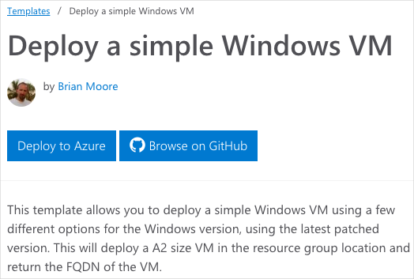
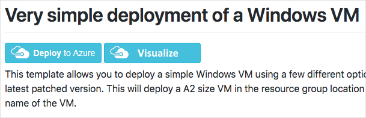
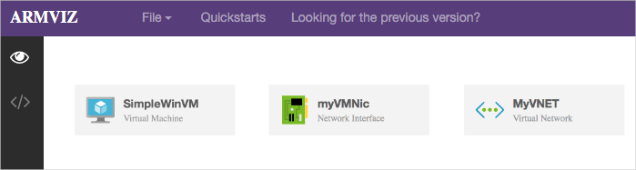
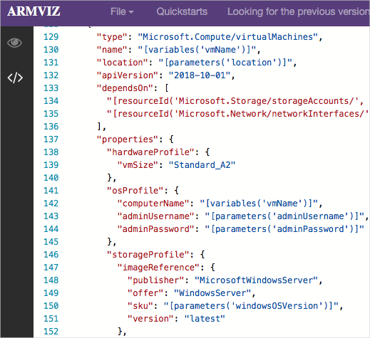

# Demonstration: Explore QuickStart templates

## Explore the gallery

1. You could start by browsing to the [Azure Quickstart Templates gallery](https://azure.microsoft.com/resources/templates?azure-portal=true). In the gallery you will find a number of popular and recently updated templates. These templates work with both Azure resources and popular software packages.
2. Browse through the many different types of templates that are available.
3. Are there are any templates that are of interest to you?

## Explore a template

1. Let's say you come across the <a href="https://azure.microsoft.com/resources/templates/101-vm-simple-windows?azure-portal=true" target="_blank"><span style="color: #0066cc;" color="#0066cc">Deploy a simple Windows VM</span></a> template.

    

    >**Notes:**
    >- The **Deploy to Azure** button enables you to deploy the template directly through the Azure portal if you wish.
    >- Scroll-down to the Use the template **PowerShell** code. You will need the **TemplateURI** in the next demo. **Copy the value**. 

```
https://raw.githubusercontent.com/Azure/azure-quickstart-templates/master/101-vm-simple-windows/azuredeploy.json
```

2. Click **Browse on GitHub** to navigate to the template's source code on GitHub.

    

3. Notice from this page you can also **Deploy to Azure**. Take a minute to view the Readme file. This helps to determine if the template is for you.  

4. Click **Visualize** to navigate to the **Azure Resource Manager Visualizer**.

    

5. Notice the resources that make up the deployment, including a VM, a storage account, and network resources.
6. Use your mouse to arrange the resources. You can also use your mouse's scroll wheel to zoom in an out.
7. Click on the VM resource labeled **SimpleWinVM**.

    

8. Review the source code that defines the VM resource.

    * The resource's type is `Microsoft.Compute/virtualMachines`.
    * Its location, or Azure region, comes from the template parameter named `location`.
    * The VM's size is **Standard_A2**.
    * The computer name is read from a template variable, and the username and password for the VM are read from template parameters.

9. Return to the QuickStart page that shows the files in the template. Copy the link to the azuredeploy.json file. It will take the format:

>**Note:** You will need the template link in the next demonstration.