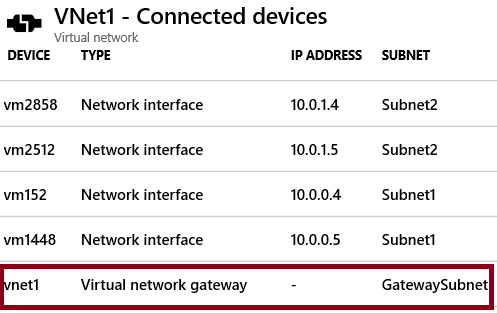

# Demonstration: Explore VNet to VNet connections

>**Note**: This demonstration works best with two virtual networks with subnets. All the steps are in the portal. 

## Explore the Gateway subnet blade

1. For one of your virtual network, select the **Subnets** blade.
1. Select **+ Gateway subnet**.

    - Notice the name of the subnet cannot be changed.  
    - Notice the **address range** of the gateway subnet. The address must be contained by the address space of the virtual network. 

1. Remember each virtual network needs a gateway subnet. 
1. Close the Add gateway subnet page. You do not need to save your changes.

## Explore the Connected Devices blade

1. For the virtual network, select the **Connected Devices** blade.
2. After a gateway subnet is deployed it will appear on the list of connected devices.

## Explore adding a virtual network gateway

1. Search for **Virtual network gateways**.
2. Click **+ Add**.
3. Review each setting for the virtual netowrk gateway.
4. Use the Information icons to learn more about the settings.
5. Notice the **Gateway type**, **VPN type**, and **SKU**. 
6. Notice the need for a **Public IP address**.
7. Remember each virtual network will need a virtual network gateway. 
8. Close the **Add virtual network gateway** page. You do not need to save your changes. 

## Explore adding a connection between the virtual networks

1. Search for **Connections**.
2. Click **+ Add**.
3. Notice the **Connection type** can be VNet-to-VNet, Site-to-Site (IPsec), or ExpressRoute.
4. Provide enough information, so you can click the **Ok** button.
5. On the **Settings** page, notice that you will need select the two different virtual networks.
6. Read the Help information on the **Establilsh bidirectional connnectivity** checkbox.
7. Notice the **Shared key (PSK)** information.
8. Close the **Add connection** page. You do not need to save your changes. 