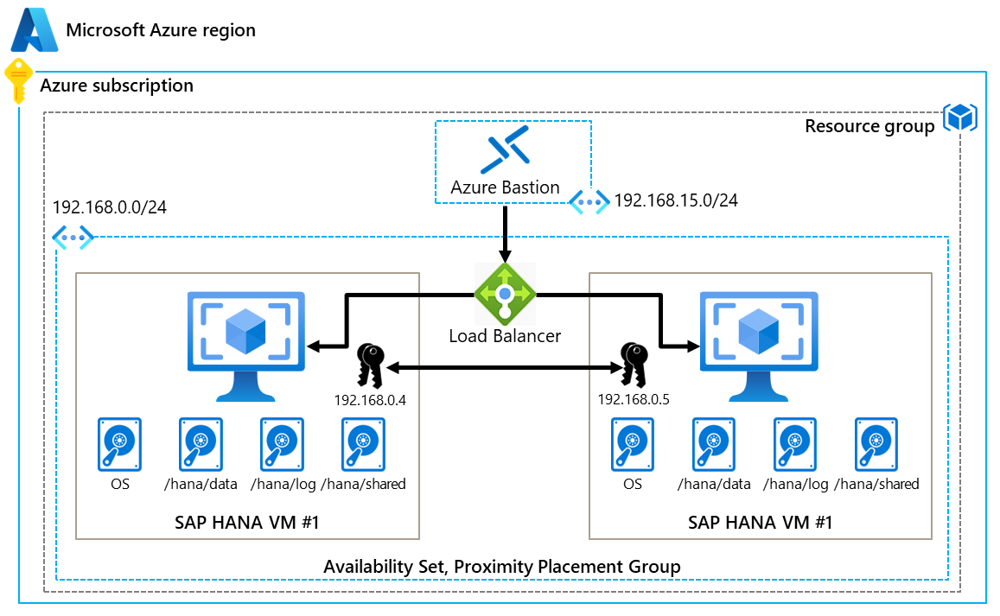
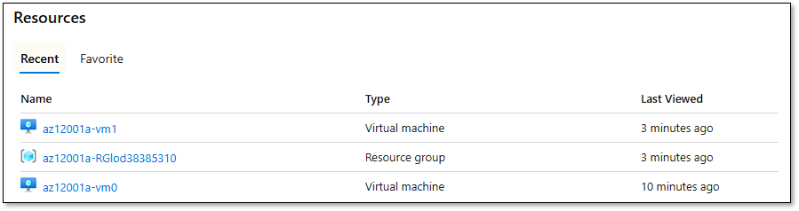
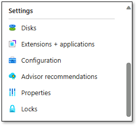
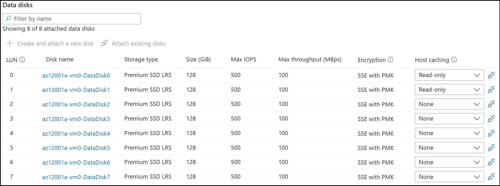
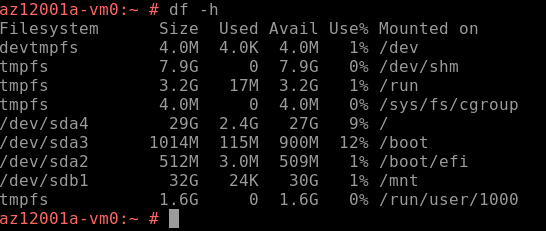
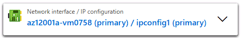
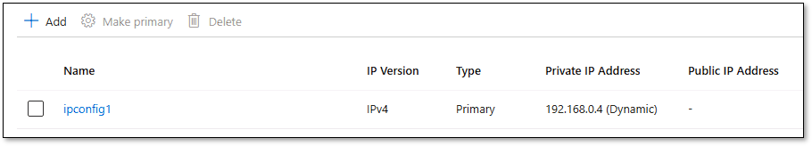
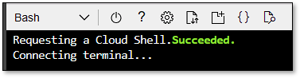

---
lab:
    title: 'Lab 01: Implement Linux clustering on Azure Virtual Machines'
    learning path: 'AZ-120 Learning Path 1: Explore the foundations of IaaS for SAP on Azure'
---

# Lab 01: Implement Linux clustering on Azure Virtual Machines

This lab is part of **AZ-120: Planning and Administering Microsoft Azure for SAP Workloads**.

## Lab introduction

After completing this lab, you will be able to:

- Provision Azure compute resources necessary to support highly available SAP HANA deployments.

- Configure the operating system of Azure Virtual Machines running Linux to support a highly available SAP HANA installation.

- Provision Azure network resources necessary to support highly available SAP HANA deployments.

This lab requires:

- A Microsoft Azure subscription with the sufficient number of available DSv3 vCPUs (2 x 4) and DSv2 (1 x 1) vCPUs.

- A lab computer with an Azure Cloud Shell-compatible web browser and access to Azure.

All tasks in this lab are performed from the [Azure portal](https://portal.azure.com) (including the Bash Cloud Shell session)  

   > **Note**: When not using Cloud Shell, the lab virtual machine must have Azure CLI installed [**https://docs.microsoft.com/en-us/cli/azure/install-azure-cli-windows**](https://docs.microsoft.com/en-us/cli/azure/install-azure-cli-windows) and include an SSH client e.g. PuTTY, available from [**https://www.chiark.greenend.org.uk/~sgtatham/putty/latest.html**](https://www.chiark.greenend.org.uk/~sgtatham/putty/latest.html).

## Estimated time: 90 minutes

## Lab scenario

Adatum Corporation, is preparing to migrate their SAP HANA deployment to Azure. In your role at Adatum, you are part of the IT team responsible for high availability and disaster recovery for their mission-critical SAP applications. The team decided to implement a Linux cluster on Azure Virtual Machines (VMs) running the SUSE distribution of Linux. This setup will provide the robustness and reliability needed for the SAP HANA deployment.

## Interactive lab simulations

There are several interactive lab simulations that you might find useful for this topic. The simulation lets you click through a similar scenario at your own pace. There are differences between the interactive simulation and this lab, but many of the core concepts are the same. An Azure subscription is not required.

- [Create a simple virtual network](https://mslearn.cloudguides.com/guides/AZ-900%20Exam%20Guide%20-%20Azure%20Fundamentals%20Exercise%204). Create a virtual network with two virtual machines. Demonstrate the virtual machines can communicate.
- [Design and implement a virtual network in Azure](https://mslabs.cloudguides.com/guides/AZ-700%20Lab%20Simulation%20-%20Design%20and%20implement%20a%20virtual%20network%20in%20Azure). Create a resource group and create virtual networks with subnets.
- [Create and configure and Azure load balancer](https://mslabs.cloudguides.com/guides/AZ-700%20Lab%20Simulation%20-%20Create%20and%20configure%20an%20Azure%20load%20balancer). Create a virtual network, backend servers, load balancer, and then test the load balancer.
- [Create a virtual machine with PowerShell](https://mslearn.cloudguides.com/en-us/guides/AZ-900%20Exam%20Guide%20-%20Azure%20Fundamentals%20Exercise%2010). Use Azure PowerShell to deploy a virtual machine. Review Azure Advisor recommendations.
- [Create a virtual machine with the CLI](https://mslearn.cloudguides.com/en-us/guides/AZ-900%20Exam%20Guide%20-%20Azure%20Fundamentals%20Exercise%2011). Use the CLI to deploy a virtual machine. Review Azure Advisor recommendations.
  
## Architecture diagram
<!-- TODO Placeholder image - update to have proper names and numbers -->


**The clustering architecture** resulting from this lab is a high-availability (HA) cluster designed to support SAP HANA deployments on Azure. This HA cluster is implemented using Linux clustering on Azure Virtual Machines running the SUSE distribution of Linux.

The cluster consists of a pair of Azure Virtual Machines configured in the same availability set, which ensures that at least one of the VMs is available during planned or unplanned maintenance. The VMs are also placed in the same proximity placement group to minimize network latency.

The VMs are configured with shared storage and password-less SSH access between nodes, enabling them to work together as a single system and share workloads. If one VM fails, the other can take over its tasks, ensuring high availability of the SAP HANA installation.

The cluster's network traffic is managed by two Azure Load Balancers, one for inbound traffic and one for outbound traffic. These load balancers distribute network traffic efficiently across the VMs and control the flow of traffic from the VMs to the internet, further enhancing the high availability and resilience of the SAP HANA deployment.

In summary, the resulting clustering architecture is a high-availability Linux cluster optimized for SAP HANA deployments on Azure, providing robust performance, minimized latency, and increased resilience.

## Job skills

- Exercise 1: Provision Azure compute resources necessary to support highly available SAP HANA deployments.

- Exercise 2: Configure operating system of Azure Virtual Machines running Linux to support a highly available SAP HANA installation.

- Exercise 3: Provision Azure network resources necessary to support highly available SAP HANA deployments.

- Exercise 4: Remove lab resources.
  
## Exercise 1: Provision Azure compute resources necessary to support highly available SAP HANA deployments

In this exercise, you will deploy Azure infrastructure compute components necessary to configure Linux clustering. This will involve creating a pair of Azure Virtual Machines running Linux SUSE in the same availability set and provisioning Azure Bastion.

### Task 1: Deploy Azure Virtual Machines running Linux SUSE

In this task, you set up new Azure Virtual Machines with a SUSE Linux Enterprise image configured for SAP applications to ensure high availability through an availability set and proximity placement group. This setup aims to provide a robust and optimized environment for SAP workloads with minimized latency and increased resilience.

1. From the lab computer, open a Web browser and navigate to the Azure portal at [https://portal.azure.com](https://portal.azure.com).

1. If prompted, sign in with the work or school or personal Microsoft account with the owner or contributor role to the Azure subscription you will be using for this lab.

1. At the top of the [Azure portal](https://portal.azure.com) page, use the **Search resources, services, and docs** text box to search for and navigate to the **Proximity placement groups** blade.

1. On the **Proximity placement groups** blade, select **+ Create**.

1. On the **Basics** tab of the **Create Proximity Placement Groups** blade, specify the following settings, and then select **Review + create** (leave others with their default values):
<!-- TODO below confirm PPG step -->
    | Setting | Value |
    |   --    |  --   |
    | **Subscription** | *the name of your Azure subscription*  |
    | **Resource group** section | Select **Create new**, enter **az12001a-RG**, and then select **OK** |
    | **Proximity placement group name** | Select **az12001a-ppg** |
    | **Region** | *the Azure region where you have sufficient vCPU quotas* |
    | **VM Sizes** | **Standard_D4s_v3** |
    | **Zone** | **No zone preference** |

   > **Note**: Consider using **East US** or **East US2** regions for deployment of your resources.

1. On the **Review + create** tab of the **Create Proximity Placement Groups** blade, select **Create**.

   > **Note**: Wait for the provisioning to complete. This should take less than a minute.

1. At the top of the [Azure portal](https://portal.azure.com) page, use the **Search resources, services, and docs** text box to search for and navigate to the **Virtual machines** blade.

1. Select **+ Create** and, on the drop-down menu, select **Azure Virtual Machine**.

1. On the **Basics** tab of the **Create a virtual machine** blade, specify the following settings, and then select **Next: Disks >**  (leave others with their default values):

    | Setting | Value |
    |   --    |  --   |
    | **Subscription** | *the name of your Azure subscription*  |
    | **Resource group** | *select the name of the resource group you used earlier in this task* |
    | **Virtual machine name** | **az12001a-vm0** |
    | **Region** | *the **same Azure region** you chose when creating the proximity placement group* |
    | **Availability options** | *select* **Availability set** |
    | **Availability set** | **Create new** *availability set named* **az12001a-avset** *with 2 fault domains and 5 update domains* |
    | **Security type** | *select* **Standard** |
    | **Image** | *select* **SUSE Enterprise Linux for SAP 15 SP3 - BYOS - x64 Gen 2** (see note below) |
    | **Run with Azure Spot Discount** | **No** |
    | **Size** | **Standard D4s v3** (see note below) |
    | **Authentication type** | **Password** (see note below) |
    | **Username** | **student** |
    | **Password** | any complex password of your choice |

    > **Note**:
    >- To locate the image, select the **See all images** link, type **SUSE Enterprise Linux** in the search text box, select **SUSE Enterprise Linux for SAP 15 SP3 - BYOS** in the list of results, and then select **Generation 2**.
    >- To locate the size, select the **See all sizes** link, type **D4s** in the search text box, and then select **D4s_v3**.
    >- Make sure you remember the password you specified during deployment. You will need it later in this lab.

1. On the **Disks** tab of the **Create a virtual machine** blade, specify the following settings, and then select **Next: Networking >** (leave others with their default values):

    | Setting | Value |
    |   --    |  --   |
    | **OS disk type** | **Premium SSD (locally-redundant storage)**  |
    | **Key management** | **Platform-managed key** |

1. On the **Networking** tab of the **Create a virtual machine** blade, under **Virtual network**, click **Create new**.

1. Specify the following settings, and then select **OK** (leave others with their default values):

    | Setting | Value |
    |   --    |  --   |
    | **Name** | **az12001a-RG-vnet** |
    | **Address space** | *set the address space of the new virtual network to* **192.168.0.0/20** |
    | **Subnet name** | **subnet-0** |
    | **Subnet address range** | **192.168.0.0/24**|

1. On the **Networking** tab of the **Create a virtual machine** blade, specify the following settings, and then select **Next: Management >** (leave others with their default values):

    | Setting | Value |
    |   --    |  --   |
    | **Public IP address** | **none** |
    | **NIC network security group** | **Advanced**  |
    | **Enable accelerated networking** | **On** |
    | **Load balancing Options** | **None** |

    > **Note**: This image has preconfigured Azure network security group (NSG) rules.

1. On the **Management** tab of the **Create a virtual machine** blade, specify the following settings, and then select **Next: Monitoring >** (leave others with their default values):

   | Setting | Value |
   |   --    |  --   |
   | **Enable system assigned managed identity** | **Off** |
   | **Enable auto-shutdown** | **Off** |
   | **Enable basic plan for free** | **No** (see note below) |
   | **Enable backup** | **off**  |

   > **Note**: The **basic plan for free** setting is not available if you have already enabled Microsoft Defender for Cloud in your subscription.

1. On the **Monitoring** tab of the **Create a virtual machine** blade, select **Next: Advanced >** (leave all settings with their default values).

1. On the **Advanced** tab of the **Create a virtual machine** blade, specify the following settings, and then select **Review + create** (leave others with their default values):

   | Setting | Value |
   |   --    |  --   |
   | **Proximity placement group** | **az12001a-ppg** |

1. On the **Review + create** tab of the **Create a virtual machine** blade, select **Create**.

   > **Note**: Wait for the provisioning to complete. This should take less about 3 minutes.

1. At the top of the [Azure portal](https://portal.azure.com) page, use the **Search resources, services, and docs** text box to search for and navigate to the **Virtual machines** blade.

1. On the **Virtual machines** blade, select **+ Create** and, on the drop-down menu, select **Azure Virtual Machine**.

1. On the **Basics** tab of the **Create a virtual machine** blade, specify the following settings, and then select **Next: Disks >** (leave others with their default values):

    | Setting | Value |
    |   --    |  --   |
    | **Subscription** | *the name of your Azure subscription*  |
    | **Resource group** | *select the name of the resource group you used earlier in this task* |
    | **Virtual machine name** | **az12001a-vm1** |
    | **Region** | *the same Azure region you chose when creating the proximity placement group* |
    | **Availability options** | *select* **Availability set** |
    | **Availability set** | *select* **az12001a-avset** |
    | **Security type** | *select* **Standard** |
    | **Image** | *select* ***SUSE Enterprise Linux for SAP 15 SP3 - BYOS - x64 Gen 2** (see note below) |
    | **Run with Azure Spot Discount** | **No** |
    | **Size** | **Standard D4s v3** |
    | **Authentication type** | **Password** |
    | **Username** | **student** |
    | **Password** | the same password you specified during the first deployment |

    > To locate the image, select the **See all images** link, type **SUSE Enterprise Linux** in the search text box, select **SUSE Enterprise Linux for SAP 15 SP3 - BYOS** in the list of results, and then select **Generation 2**.

1. On the **Disks** tab of the **Create a virtual machine** blade, specify the following settings, and then select **Next: Networking >** (leave others with their default values):

    | Setting | Value |
    |   --    |  --   |
    | **OS disk type** | **Premium SSD (locally-redundant storage)** |
    | **Key management** | **Platform-managed key** |

1. On the **Networking** tab of the **Create a virtual machine** blade, specify the following settings, and then select **Next: Management >** (leave others with their default values):

    | Setting | Value |
    |   --    |  --   |
    | **Virtual network** | **az12001a-RG-vnet** |
    | **Subnet** | **subnet-0 (192.168.0.0/24)** |
    | **Public IP address** | **none** |
    | **NIC network security group** | **Advanced**  |
    | **Enable accelerated networking** | **On** |
    | **Load balancing Options** | **None** |

   > **Note**: This image has preconfigured NSG rules.

1. On the **Management** tab of the **Create a virtual machine** blade, specify the following settings, and then select **Next: Monitoring >** (leave others with their default values):

   | Setting | Value |
   |   --    |  --   |
   | **Enable system assigned managed identity** | **Off** |
   | **Enable auto-shutdown** | **Off** |
   | **Enable basic plan for free** | **No**  |
   | **Enable backup** | **off**  |

   > **Note**: The **basic plan for free** setting is not available if you have already selected the Azure Security Center plan.

1. On the **Monitoring** tab of the **Create a virtual machine** blade, select **Next: Advanced >** (leave all settings with their default values).

1. On the **Advanced** tab of the **Create a virtual machine** blade, specify the following settings, and then select **Review + create** (leave others with their default values):

   | Setting | Value |
   |   --    |  --   |
   | **Proximity placement group** | **az12001a-ppg** |

1. On the **Review + create** tab of the **Create a virtual machine** blade, select **Create**.

   > **Note**: Wait for the provisioning to complete. This should take less about 3 minutes.

### Task 2: Create and configure Azure Virtual Machine disks

In this task, you use the Azure Cloud Shell to provision a set of Azure Virtual Machine **managed disks** and attach them to your SUSE Linux VMs from Task 1. This process involves initializing the disks, setting appropriate LUN values, and configuring host caching to optimize performance for your SAP applications.

1. At the top of the [Azure portal](https://portal.azure.com) page, click the Cloud Shell icon to start a Bash session in Cloud Shell.

   

   > **Note**: If this is the first time you are launching Cloud Shell in the current Azure subscription, you will be asked to create an Azure file share to persist Cloud Shell files. If so, choose Bash and accept the defaults, which will result in creation of a storage account in an automatically generated resource group.

1. In the Cloud Shell pane, run the following command to set the value of the variable `RESOURCE_GROUP_NAME` to the name of the resource group containing the resources you provisioned in the previous task:

   ```cli
   RESOURCE_GROUP_NAME='az12001a-RG'
   ```

1. In the Cloud Shell pane, run the following command to create the first set of 8 managed disks that you will attach to the first Azure Virtual Machine you deployed in the previous task:

   ```cli
   LOCATION=$(az group list --query "[?name == '$RESOURCE_GROUP_NAME'].location" --output tsv)

   for I in {0..7}; do az disk create --resource-group $RESOURCE_GROUP_NAME --name az12001a-vm0-DataDisk$I --size-gb 128 --location $LOCATION --sku Premium_LRS; done
   ```

1. In the Cloud Shell pane, run the following command to create the second set of 8 managed disks that you will attach to the second Azure Virtual Machine you deployed in the previous task:

   ```cli
   for I in {0..7}; do az disk create --resource-group $RESOURCE_GROUP_NAME --name az12001a-vm1-DataDisk$I --size-gb 128 --location $LOCATION --sku Premium_LRS; done
   ```
1. Close the Cloud Shell pane.

1. In the [Azure portal](https://portal.azure.com), navigate to the blade of the first Azure Virtual Machine you provisioned in the previous task (**az12001a-vm0**).

   

1. In the left pane, select **settings**, then select **Disks**.

   

1. On the **az12001a-vm0 \| Disks** blade, select **Attach existing disks** and attach a data disk with the following settings to az12001a-vm0:

   | Setting | Value |
   |   --    |  --   |
   | **LUN** | **0** |
   | **Disk name** | select **az12001a-vm0-DataDisk0** |
   | **Resource group** | *select the name of the resource group you used earlier in this task* |
   | **HOST CACHING** | **Read-only** |

1. Repeat the previous step to attach the remaining 7 disks with the prefix **az12001a-vm0-DataDisk** (for the total of 8). Assign the LUN number matching the last character of the disk name. Set HOST CACHING of the disk with LUN **1** to **Read-only** and, for all the remaining ones, set HOST CACHING to **None**.

   

1. Select **Apply** to save your changes.

1. In the [Azure portal](https://portal.azure.com), navigate to the blade of the second Azure Virtual Machine you provisioned in the previous task (**az12001a-vm1**).

   

1. In the left pane, select **Disks**.

   

1. From the **az12001a-vm1 \| Disks** blade, attach a data disk with the following settings to az12001a-vm1:

   | Setting | Value |
   |   --    |  --   |
   | **LUN** | **0** |
   | **Disk name** | **az12001a-vm1-DataDisk0** |
   | **Resource group** | *select the name of the resource group you used earlier in this task* |
   | **HOST CACHING** | **Read-only** |

1. Repeat the previous step to attach the remaining 7 disks with the prefix **az12001a-vm1-DataDisk** (for the total of 8).
    - Assign the LUN number matching the last character of the disk name.
    - Set HOST CACHING of the disk with LUN **1** to **Read-only**
    - Set HOST CACHING of the remaining disks to **None**.

1. Select **Apply** to save your changes.

### Task 3: Provision Azure Bastion

In this task, you'll use Azure Bastion to securely connect to your SUSE Linux Azure virtual machines. You'll set up a dedicated subnet and deploy the Bastion service for secure virtual machine access within the Azure portal, minimizing exposure to public endpoints and increasing protection against brute force attacks.

> **Note**: To use Azure Bastion, ensure that your browser has the pop-up functionality enabled.

1. In the browser window displaying the Azure portal, open another tab and navigate to the [Azure portal](https://portal.azure.com).

1. At the top of the [Azure portal](https://portal.azure.com) page, click the Cloud Shell icon and start a bash session in Cloud Shell.

   

1. From the PowerShell session in the Cloud Shell pane, run the following to add a subnet named **AzureBastionSubnet** to the virtual network named **az12001a-RG-vnet** you created earlier in this exercise:
   ```bash
   resourceGroupName='az12001a-RG'
   vnetName='az12001a-RG-vnet'
   subnetName='AzureBastionSubnet'
   addressPrefix='192.168.15.0/24'
    
   # Get the virtual network
   vnetId=$(az network vnet show --resource-group $resourceGroupName --name $vnetName --query id --output tsv)
    
   # Add the subnet configuration
   az network vnet subnet create --resource-group $resourceGroupName --vnet-name $vnetName --name $subnetName --address-prefix $addressPrefix
   ```

   <!-- TODO Delete this after BASH version tested
     ```powershell
   $resourceGroupName = 'az12001a-RG'
   $vnet = Get-AzVirtualNetwork -ResourceGroupName $resourceGroupName -Name 'az12001a-RG-vnet'
   $subnetConfig = Add-AzVirtualNetworkSubnetConfig `
     -Name 'AzureBastionSubnet' `
     -AddressPrefix 192.168.15.0/24 `
     -VirtualNetwork $vnet
   $vnet | Set-AzVirtualNetwork
   ``` -->

1. Close the Cloud Shell pane.

1. At the top of the [Azure portal](https://portal.azure.com) page, use the **Search resources, services, and docs** text box to search for and navigate to the **Bastions** blade.

1. On the **Bastions** blade, select **+ Create**.

1. On the **Basic** tab of the **Create a Bastion** blade, specify the following settings, and then select **Review + create** (leave others with their default values):

   |Setting|Value|
   |---|---|
   |Subscription|the name of the Azure subscription you are using in this lab|
   |Resource group|**az12001a-RG**|
   |Name|**az12001a-bastion**|
   |Region|the same Azure region to which you deployed the resources in the previous task of this exercise|
   |Tier|**Basic**|
   |Virtual network|**az12001a-RG-vnet**|
   |Subnet|**AzureBastionSubnet (192.168.15.0/24)**|
   |Public IP address|**Create new**|
   |Public IP name|**az12001a-RG-vnet-ip**|

1. On the **Review + create** tab of the **Create a Bastion** blade, select **Create**:

   > **Note**: Wait for the deployment to complete before you proceed to the next task of this exercise. The deployment might take about 5 minutes.

### Exercise 1 result

In exercise 1, you provisioned Azure compute, storage and network resources necessary to support highly available SAP HANA deployments. Furthermore, you deployed Azure Bastion to securely connect to your SUSE Linux Azure VMs.

## Exercise 2: Configuring Linux OS on Azure Virtual Machines for High Availability SAP HANA Installation

In this exercise, you will configure operating system and storage on Azure Virtual Machines running SUSE Linux Enterprise Server to accommodate clustered installations of SAP HANA.

### Task 1: Connect to Linux virtual machines

In task 1, you establish remote connections to your Azure Linux virtual machines using the Azure portal's Bastion service. You will access both az12001a-vm0 and az12001a-vm1 virtual machines securely to prepare for the configuration needed for a highly available SAP HANA installation.

1. From your lab computer, in the [Azure portal](https://portal.azure.com), search for and select **Virtual machines**.

1. On the **Virtual machines** blade, select the **az12001a-vm0** entry. This will open the **az12001a-vm0** blade.

1. Select **Connect**, and then, on the drop-down menu, select **Connect via Bastion**.

1. On the **Bastion** tab of the **az12001a-vm0** blade, provide the credentials you set when deploying the **az12001a-vm0** virtual machine.

1. Leave the **Authentication type** set to **VM Password**, leave the **Open in new browser tab** check box enabled, and then select **Connect**.

1. Repeat these steps to connect via Bastion to the **az12001a-vm1** Azure Virtual Machine.

### Task 2: Configure storage of Azure Virtual Machines running Linux

In this task, you partition and format a new disk, create mount point directories, and configure the system to automatically mount the new volumes at boot by editing the `/etc/fstab` file. The task is completed on the **az12001a-vm0** virtual machine and then repeated on the second VM, **az12001a-vm1**, to ensure both have the necessary storage configurations.

1. Within the Bastion session to the **az12001a-vm0** Azure Virtual Machine, run the following command to elevate privileges:

   ```cli
   sudo su -
   ```

<!-- TODO: Steps to paste text in session-->

1. Run the following command to identify the mapping between the newly attached devices and their LUN numbers:

   ```cli
   lsscsi
   ```

1. Create physical volumes for 6 (out of 8) data disks by running:

   ```cli
   pvcreate /dev/sdc
   pvcreate /dev/sdd
   pvcreate /dev/sde
   pvcreate /dev/sdf
   pvcreate /dev/sdg
   pvcreate /dev/sdh
   ```

1. Create volume groups by running:

   ```cli
   vgcreate vg_hana_data /dev/sdc /dev/sdd
   vgcreate vg_hana_log /dev/sde /dev/sdf
   vgcreate vg_hana_backup /dev/sdg /dev/sdh
   ```

1. Create logical volumes by running:

   ```cli
   lvcreate -l 100%FREE -n hana_data vg_hana_data
   lvcreate -l 100%FREE -n hana_log vg_hana_log
   lvcreate -l 100%FREE -n hana_backup vg_hana_backup
   ```

   > **Note**: We are creating a single logical volume per each volume group.

1. Format the logical volumes by running:

   ```cli
   mkfs.xfs /dev/vg_hana_data/hana_data -m crc=1
   mkfs.xfs /dev/vg_hana_log/hana_log -m crc=1
   mkfs.xfs /dev/vg_hana_backup/hana_backup -m crc=1
   ```

   > **Note**: Starting with SUSE Linux Enterprise Server 12, you have the option to use the new on-disk format (v5) of the XFS file system, which offers automatic checksums of XFS metadata, file type support, and an increased limit on the number of access control lists per file. The new format applies automatically when using YaST to create the XFS file systems. To create an XFS file system in the older format for compatibility reasons, use the mkfs.xfs command without the `-m crc=1` option.

1. Partition the **/dev/sdi** disk by running:

   ```cli
   fdisk /dev/sdi
   ```

1. When prompted, type, in sequence, `n`, `p`, `1` (followed by the **Enter** key each time) press the **Enter** key twice more, and then type `w` to complete the write.

1. Partition the **/dev/sdj** disk by running:

   ```cli
   fdisk /dev/sdj
   ```

1. When prompted, type, in sequence, `n`, `p`, `1` (followed by the **Enter** key each time) press the **Enter** key twice, and then type `w` to complete the write.

1. Format the newly created partition by running (type `y` and press the **Enter** key if prompted for confirmation):

   ```cli
   mkfs.xfs /dev/sdi -m crc=1 -f
   mkfs.xfs /dev/sdj -m crc=1 -f
   ```

1. Create the directories that will serve as mount points by running:

   ```cli
   mkdir -p /hana/data
   mkdir -p /hana/log
   mkdir -p /hana/backup
   mkdir -p /hana/shared
   mkdir -p /usr/sap
   ```

1. Display the ids of logical volumes, to gather the **UUID** values associated with the new volume groups and partitions, by running:

   ```cli
   blkid
   ```

   > **Note**: Identify the **UUID** values associated with the newly created volume groups and partitions, including **/dev/sdi** (to be used for **/hana/shared**) and **dev/sdj** (to be used for **/usr/sap**).

<!-- TODO: explain what to copy from output above -->

1. Open **/etc/fstab** in the vi editor (you are free to use any other editor) by running:

   ```cli
   vi /etc/fstab
   ```

1. In the editor, add the following entries to **/etc/fstab** (where `\<UUID of /dev/vg\_hana\_data-hana\_data\>`, `\<UUID of /dev/vg\_hana\_log-hana\_log\>`, `\<UUID of /dev/vg\_hana\_backup-hana\_backup\>`, `\<UUID of /dev/vg_hana_shared-hana_shared (/dev/sdi)\>`, and `\<UUID of /dev/vg_usr_sap-usr_sap (/dev/sdj)\>`, represent the ids you identified in the previous step):

   ```cli
   /dev/disk/by-uuid/<UUID of /dev/vg_hana_data-hana_data> /hana/data xfs  defaults,nofail  0  2
   /dev/disk/by-uuid/<UUID of /dev/vg_hana_log-hana_log> /hana/log xfs  defaults,nofail  0  2
   /dev/disk/by-uuid/<UUID of /dev/vg_hana_backup-hana_backup> /hana/backup xfs  defaults,nofail  0  2
   /dev/disk/by-uuid/<UUID of /dev/vg_hana_shared-hana_shared (/dev/sdi)> /hana/shared xfs  defaults,nofail  0  2
   /dev/disk/by-uuid/<UUID of /dev/vg_usr_sap-usr_sap (/dev/sdj)> /usr/sap xfs  defaults,nofail  0  2
   ```
   > **Note**: To edit the file with vi editor, press i to enter INSERT mode.

   

1. Save the changes and close the editor.
   > **Note**: Press Esc to exit INSERT mode and type :wq to save.

1. Mount the new volumes by running:

   ```cli
   mount -a
   ```

1. Verify that the mount was successful by running:

   ```cli
   df -h
   ```
   

1. Switch to the Bastion session to az12001a-vm1 and repeat all of the steps in this task to configure storage on **az12001a-vm1**.

### Task 3: Enable cross-node password-less SSH access

In this task, you configure password-less SSH access between two Azure Virtual Machines by generating and exchanging RSA keys, adjusting SSH daemon settings to permit root login with these keys, and verifying that secure, password-free connections can be established successfully.

   | **az12001a-vm0** Azure Virtual Machine Bastion session |

1. Within the Bastion session to the **az12001a-vm0** Azure Virtual Machine, generate passphrase-less SSH key by running:

   ```cli
   ssh-keygen -t rsa
   ```

1. When prompted, press **Enter** three times, and then display the public key by running:

   ```cli
   cat /root/.ssh/id_rsa.pub
   ```

1. Copy the value of the key into Clipboard.

1. Switch to the Bastion session to the **az12001a-vm1** Azure Virtual Machine.

1. Within the Bastion session to the **az12001a-vm1** Azure Virtual Machine, run the following command to elevate privileges:

   ```cli
   sudo su -
   ```

1. create a file **/root/.ssh/authorized\_keys** in the vi editor (you are free to use any other editor) by running:

   ```cli
   vi /root/.ssh/authorized_keys
   ```

1. In the editor window, paste the key you generated on **az12001a-vm0**.

1. Save the changes and close the editor.

1. Within the Bastion session to the **az12001a-vm1** Azure Virtual Machine, generate a passphrase-less SSH key by running:

   ```cli
   ssh-keygen -t rsa
   ```

1. When prompted, press **Enter** three times, and then display the public key by running:

   ```cli
   cat /root/.ssh/id_rsa.pub
   ```

1. Copy the value of the key into Clipboard.

1. Switch to the Bastion session to the **az12001a-vm0** Azure Virtual Machine and create a file **/root/.ssh/authorized\_keys** in the vi editor (you are free to use any other editor) by running:

   ```cli
   vi /root/.ssh/authorized_keys
   ```

1. In the editor window, paste the key you generated on **az12001a-vm1**.

1. Save the changes and close the editor.

1. Within the Bastion session to the **az12001a-vm0** Azure Virtual Machine, generate a passphrase-less SSH key by running:

   ```cli
   ssh-keygen -t rsa
   ```

1. When prompted, press **Enter** three times, and then display the public key by running:

   ```cli
   cat /root/.ssh/id_rsa.pub
   ```

1. Copy the value of the key into Clipboard.

1. Switch to the Bastion session to the **az12001a-vm1** Azure Virtual Machine, and open the file **/root/.ssh/authorized\_keys** in the vi editor (you are free to use any other editor) by running:

   ```cli
   vi /root/.ssh/authorized_keys
   ```

1. In the editor window, starting from a new line, paste the key you generated on **az12001a-vm0**.

1. Save the changes and close the editor.

1. Within the Bastion session to the **az12001a-vm1** Azure Virtual Machine, generate a passphrase-less SSH key by running:

   ```cli
   ssh-keygen -t rsa
   ```

1. When prompted, press **Enter** three times, and then display the public key by running:

   ```cli
   cat /root/.ssh/id_rsa.pub
   ```

1. Copy the value of the key into Clipboard.

1. Switch to the Bastion session to the **az12001a-vm0** Azure Virtual Machine and open the file **/root/.ssh/authorized\_keys** in the vi editor (you are free to use any other editor) by running:

   ```cli
   vi /root/.ssh/authorized_keys
   ```

1. In the editor window, starting from a new line, paste the key you generated on **az12001a-vm1**.

1. Save the changes and close the editor.

1. Within the Bastion session to the **az12001a-vm0** Azure Virtual Machine, open the file **/etc/ssh/sshd\_config** in the vi editor (you are free to use any other editor) by running:

   ```cli
   vi /etc/ssh/sshd_config
   ```

1. In the **/etc/ssh/sshd\_config** file, locate the **PermitRootLogin** and **AuthorizedKeysFile** entries, and configure them as follows (remove the leading **#** character if needed):

   ```cli
   PermitRootLogin yes
   AuthorizedKeysFile  /root/.ssh/authorized_keys
   ```

1. Save the changes and close the editor.

1. Within the Bastion session to the **az12001a-vm0** Azure Virtual Machine, restart sshd daemon by running:

   ```cli
   systemctl restart sshd
   ```

1. Repeat the previous four steps starting with `vi /etc/ssh/sshd_config` on **az12001a-vm1**.

1. To verify that the configuration was successful, in the Bastion session to the **az12001a-vm0** Azure Virtual Machine, establish an SSH session as **root** from az12001a-vm0 to az12001a-vm1 by running:

   ```cli
   ssh root@az12001a-vm1
   ```

1. When prompted whether you are sure to continue connecting, type `yes` and press the **Enter** key.

1. Ensure that you are not prompted for the password.

1. Close the SSH session from az12001a-vm0 to az12001a-vm1 by running:

   ```cli
   exit
   ```

1. Sign out from az12001a-vm0 by running the following twice:

   ```cli
   exit
   ```

1. To verify that the configuration was successful, in the Bastion session to **az12001a-vm1**, establish an SSH session as **root** from az12001a-vm1 to az12001a-vm0 by running:

   ```cli
   ssh root@az12001a-vm0
   ```

1. When prompted whether you are sure to continue connecting, type `yes` and press the **Enter** key.

1. Ensure that you are not prompted for the password.

1. Close the SSH session from az12001a-vm1 to az12001a-vm0 by running:

   ```cli
   exit
   ```

1. Sign out from az12001a-vm1 by running the following twice:

   ```cli
   exit
   ```

### Exercise 2 result

In this exercise, connecting via Azure Bastion you have configured Azure Virtual Machines running Linux with shared storage, and enabled password-less SSH access between nodes to support a highly available SAP HANA installation.

## Exercise 3: Provision Azure network resources necessary to support highly available SAP HANA deployments

In this exercise, you will implement Azure Load Balancers to accommodate clustered installations of SAP HANA.

### Task 1: Configure Azure Virtual Machines to facilitate load balancing setup

In task 1, you configure the network settings of an Azure Virtual Machine to enable load balancing for SAP HANA clusters. You modify the IP configuration to a static assignment, ensuring stable connectivity for the load balancer setup.

1. At the top of the [Azure portal](https://portal.azure.com) page, use the **Search resources, services, and docs** text box to search for and navigate to the blade of the **az12001a-vm0** Azure Virtual Machine.

1. In the left pane, select **Network settings** to open the **az12001a-vm0 \| Network settings** blade.

1. Select the entry representing the network interface of **az12001a-vm0**.

   

1. In the left pane, select **IP configurations**, and then select **ipconfig1**.

   

1. Set the private IP address assignment to **Static**, and then save the change.

### Task 2: Create and configure Azure Load Balancers handling inbound traffic

In this task, you configure an Azure Load Balancer with static IP, backend pools, health probes, and load balancing rules to ensure efficient traffic distribution for your SAP HANA cluster.

1. At the top of the [Azure portal](https://portal.azure.com) page, use the **Search resources, services, and docs** text box to search for and navigate to the **Load balancers** blade.

1. On the **Load balancers** blade, select **+ Create**.

1. From the **Basics** tab of the **Create load balancer** blade, specify the following settings, and then select **Next : Frontend IP Configuration** (leave others with their default values):

   | Setting | Value |
   |   --    |  --   |
   | **Subscription** | *the name of your Azure subscription* |
   | **Resource group** | *select the name of the resource group you used earlier in this lab* |
   | **Name** | **az12001a-lb0** |
   | **Region** | *the same Azure region where you deployed Azure Virtual Machines in the first exercise of this lab* |
   | **SKU** | **Standard** |
   | **Type** | **Internal** |

1. On the **Frontend IP configuration** screen, select **Add a frontend IP configuration**, specify the following settings, and then select **Add** (leave others with their default values):

   | Setting | Value |
   |   --    |  --   |
   | **Name** | **frontend1** |
   | **Virtual network** | **az12001a-RG-vnet** |
   | **Subnet** | **subnet-0** |
   | **IP address assignment** | **Static** |
   | **IP address** | **192.168.0.240** |
   | **Availability zone** | **Zone redundant** |

1. Select **Review + create**, and then select **Create**.

   > **Note**: Wait until the load balancer is provisioned. This should take less than a minute.

1. At the top of the [Azure portal](https://portal.azure.com) page, use the **Search resources, services, and docs** text box to search for and navigate to the blade for the newly-provisioned **az12001a-lb0** load balancer.

1. In the left pane, select **Backend pools**.

1. Select **+ Add** and, on the **Add backend pool**, specify the following settings, and then select **Save** (leave others with their default values):

   | Setting | Value |
   |   --    |  --   |
   | **Name** | **az12001a-lb0-bepool** |
   | **Virtual network** | **az12001a-RG-vnet** |
   | **Backend Pool Configuration** | **IP address** |
   | **IP address** | **192.168.0.4** Resource name: **az12001a-vm0** |
   | **IP address** | **192.168.0.5** Resource name: **az12001a-vm1** |

1. On the **az12001a-lb0** blade, in the left pane select **Health probes**.

1. Select **+ Add** and, on the **Add health probe** blade, specify the following settings, and then select **Save** (leave others with their default values):

   | Setting | Value |
   |   --    |  --   |
   | **Name** | **az12001a-lb0-hprobe** |
   | **Protocol** | **TCP** |
   | **Port** | **62500** |
   | **Interval** | **5** *seconds* |

1. In the left pane, select **Load balancing rules**.

1. Select **+ Add** and, on the **Add load balancing rule** blade, specify the following settings, and then select **Save** (leave others with their default values):

   | Setting | Value |
   |   --    |  --   |
   | **Name** | **az12001a-lb0-lbruleAll** |
   | **IP Version** | **IPv4** |
   | **Frontend IP address** | **192.168.0.240 (LoadBalancerFrontEnd)** |
   | **Backend pool** | **az12001a-lb0-bepool (2 virtual machines)** |
   | **High availability ports** | **Enabled** |
   | **Health probe** | **az12001a-lb0-hprobe (TCP:62500)** |
   | **Session persistence** | **None** |
   | **Idle timeout (minutes)** | **4** |
   | **Enable TCP reset** | **Disabled** |
   | **Enable Floating IP** | **Enabled** |

### Task 3: Create and configure Azure Load Balancers handling outbound traffic

In this task, you set up an Azure Load Balancer to manage outbound traffic for your resources. You create a public IP, configure the load balancer with backend pools, and define an outbound rule to control traffic flow from your virtual machines to the internet.

1. At the top of the [Azure portal](https://portal.azure.com) page, click the Cloud Shell icon to start a Bash session in Cloud Shell.

   

1. In the Cloud Shell pane, run the following command to set the value of the variable `RESOURCE_GROUP_NAME` to the name of the resource group containing the resources you provisioned in the first exercise of this lab:

   ```cli
   RESOURCE_GROUP_NAME='az12001a-RG'
   ```

1. In the Cloud Shell pane, run the following command to create the public IP address to be used by the second load balancer:

   ```cli
   LOCATION=$(az group list --query "[?name == '$RESOURCE_GROUP_NAME'].location" --output tsv)

   PIP_NAME='az12001a-lb1-pip'

   az network public-ip create --resource-group $RESOURCE_GROUP_NAME --name $PIP_NAME --sku Standard --location $LOCATION
   ```

1. In the Cloud Shell pane, run the following command to create the second load balancer:

   ```cli
   LB_NAME='az12001a-lb1'

   LB_BE_POOL_NAME='az12001a-lb1-bepool'

   LB_FE_IP_NAME='az12001a-lb1-fe'

   az network lb create --resource-group $RESOURCE_GROUP_NAME --name $LB_NAME --sku Standard --backend-pool-name $LB_BE_POOL_NAME --frontend-ip-name $LB_FE_IP_NAME --location $LOCATION --public-ip-address $PIP_NAME
   ```

1. In the Cloud Shell pane, run the following command to create the outbound rule of the second load balancer:

   ```cli
   LB_RULE_OUTBOUND='az12001a-lb1-ruleoutbound'

   az network lb outbound-rule create --resource-group $RESOURCE_GROUP_NAME --lb-name $LB_NAME --name $LB_RULE_OUTBOUND --frontend-ip-configs $LB_FE_IP_NAME --protocol All --idle-timeout 4 --outbound-ports 1000 --address-pool $LB_BE_POOL_NAME
   ```

1. Close the Cloud Shell pane.

1. At the top of the [Azure portal](https://portal.azure.com) page, use the **Search resources, services, and docs** text box to search for and navigate to the blade displaying the properties of the newly created Azure Load Balancer **az12001a-lb1**.

1. In the left pane, select **Backend pools**.

1. On the **az12001a-lb1 \| Backend pools** blade, select **az12001a-lb1-bepool**.

1. On the **az12001a-lb1-bepool** blade, specify the following settings, and then select **Save** (leave others with their default values):

   | Setting | Value |
   |   --    |  --   |
   | **Virtual network** | **az12001a-rg-vnet (2 VM)** |
   | **Virtual machine** | **az12001a-vm0**  IP Configuration: **ipconfig1 (192.168.0.4)** |
   | **Virtual machine** | **az12001a-vm1**  IP Configuration: **ipconfig1 (192.168.0.5)** |

### Exercise 3 result

After you complete this exercise, you have provisioned Azure Load Balancers to manage both inbound and outbound traffic for a highly available setup, ensuring efficient distribution and control of network flow for your virtual machine resources.

## Exercise 4: Remove lab resources

In this exercise, you will remove resources provisioned in this lab.

### Task 1: List resource groups to be deleted

1. At the top of the [Azure portal](https://portal.azure.com) page, click the Cloud Shell icon to start a Bash session in Cloud Shell.

1. In the Cloud Shell pane, run the following command to set the value of the variable `RESOURCE_GROUP_PREFIX` to the prefix of the name of the resource group containing the resources you provisioned in this lab:

   ```cli
   RESOURCE_GROUP_PREFIX='az12001a-'
   ```

1. In the Cloud Shell pane, run the following command to list all resource groups you created in this lab:

   ```cli
   az group list --query "[?starts_with(name,'$RESOURCE_GROUP_PREFIX')]".name --output tsv
   ```

1. Verify that the output contains only the resource group you created in this lab. This resource group with all of their resources will be deleted in the next task.

### Task 2: Delete resource groups

1. In the Cloud Shell pane, run the following command to delete the resource group and their resources.

   ```cli
   az group list --query "[?starts_with(name,'$RESOURCE_GROUP_PREFIX')]".name --output tsv | xargs -L1 bash -c 'az group delete --name $0 --no-wait --yes'
   ```

1. Close the Cloud Shell pane.

### Exercise 4 result

After you complete this exercise, you have removed the resources used in this lab.

## Key takeaways

Congratulations! Now that you have completed this lab, you know how to:

- Provision Azure compute resources necessary to support highly available SAP HANA deployments.

- Configure the operating system of Azure Virtual Machines running Linux to support a highly available SAP HANA installation.

- Provision Azure network resources necessary to support highly available SAP HANA deployments.

## Learn more with self-paced training

- [TODO](https://TODO). TODO.
