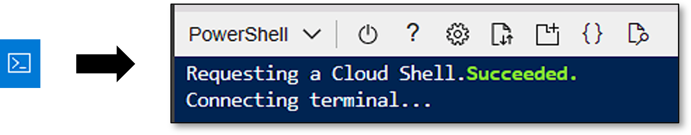
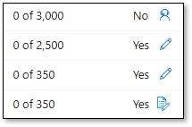
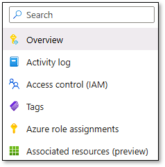
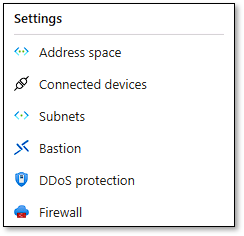
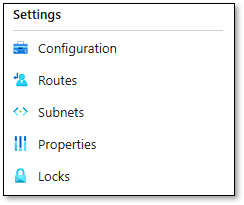
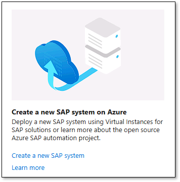

---
lab:
    title: 'Lab 03: Automate deployment by using Azure Center for SAP solutions'
    learning path: 'AZ-120 Learning Path 4: Deploy SAP on Azure'
---

# Lab 03: Automate deployment by using Azure Center for SAP solutions

This lab is part of **AZ-120: Planning and Administering Microsoft Azure for SAP Workloads**.

## Lab introduction

Azure Center for SAP Solutions (ACSS) offers a range of services and tools to help you deploy and manage your SAP environment effectively.

After completing this lab, you will be able to:

- Implement prerequisites for deploying SAP workloads in Azure by using Azure Center for SAP solutions.

- Deploy the infrastructure that will host SAP workloads in Azure by using Azure Center for SAP solutions.

All tasks in this lab are performed from the [Azure portal](https://portal.azure.com) (including the Bash Cloud Shell session)  

## Estimated time: 100 minutes

## Lab scenario

You're an SAP professional responsible for managing SAP workloads in your organization, Adatum Corporation. You're looking for ways to deploy and manage your SAP environment more efficiently on a secure, scalable, and reliable cloud platform.

## Interactive lab simulations

There are several interactive lab simulations that you might find useful for this topic. The simulation lets you click through a similar scenario at your own pace. There are differences between the interactive simulation and this lab, but many of the core concepts are the same. An Azure subscription is not required.

- [TODO](https://TODO). TODO.
  
## Architecture diagram


TODO

## Job skills

- Exercise 1: Implement prerequisites for deploying SAP workloads in Azure by using Azure Center for SAP solutions.

- Exercise 2: Deploy the infrastructure that will host SAP workloads in Azure by using Azure Center for SAP solutions.
  
## Exercise 1: Implement prerequisites for deploying SAP workloads in Azure by using Azure Center for SAP solutions

In this exercise, you will implement prerequisites for deploying SAP workloads in Azure by using Azure Center for SAP solutions. This will include the following tasks:

- Addressing the vCPU requirements in the target Azure subscription.

- Configuring Azure role-based access control (RBAC) role assignments for the Microsoft Entra ID user account that will be used to perform the deployment.

- Creating a storage account associated with the Azure Center for SAP solutions used for the deployment.

- Creating a user-assigned managed identity to be used by Azure Center for SAP solutions for authentication and authorization of its automated deployment.

- Creating a network security group (NSG) to be used within subnets of the virtual network that will host the deployment.

- Creating route tables to be used within subnets of the virtual network that will host the deployment.

- Creating and configuring the virtual network that will host the deployment.

- Deploying Azure Firewall into the virtual network that will host the deployment.

- Deploying Azure Bastion into the virtual network that will host the deployment.

### Task 1: Address the vCPU requirements in the target Azure subscription

You do not need to complete this task if you have already implemented all of [the AZ-120 lab prerequisites](https://github.com/MicrosoftLearning/AZ-120-Planning-and-Administering-Microsoft-Azure-for-SAP-Workloads/blob/master/Instructions/AZ-120_Lab00_Prerequisites.md).<TODO - is this task necessary? If the prerequisites are provided, we should be able to assume they are being met, right?>

To complete this lab (as described), you will need a Microsoft Azure subscription with the vCPU quotas that accommodate deployment of the following virtual machines:

- 2 x Standard_E4ds_v4 (4 vCPUs and 32 GiB of memory each) or 2 X Standard_D4ds_v4 (4 vCPUs and 16 GiB of memory each) virtual machines for the ASCS tier

- 2 x Standard_E4ds_v4 (4 vCPUs and 32 GiB of memory each) or 2 X Standard_D4ds_v4 (4 vCPUs and 16 GiB of memory each) virtual machines for the application tier

- 2 x Standard_M64ms (64 vCPUs and 1750 GiB of memory each) virtual machines for the database tier

> **Note**: To minimize the vCPU and memory requirements for the database virtual machines, you can change the virtual machine SKU to Standard_M32ts (32 vCPUs and 192 GiB of memory each).

1. On the lab computer, open the [Azure portal](https://portal.azure.com) in a Microsoft Edge browser window.

1. At the top of the [Azure portal](https://portal.azure.com) page, click the Cloud Shell icon to start a PowerShell session in Cloud Shell.

   

    > **Note**: If this is the first time you are launching Cloud Shell in the Azure subscription you will be using in this lab, you will be asked to create an Azure file share to persist Cloud Shell files. If so, accept the defaults, which will result in creation of a storage account in an automatically generated resource group.

1. In the [Azure portal](https://portal.azure.com), in the **Cloud Shell** pane, at the PowerShell prompt, run the following (if needed, replace `eastus` with the name of the Azure region to which you intend to deploy resources in this lab):

    > **Note**: To identify the names of Azure regions, in the **Cloud Shell**, at the Bash prompt, run `(Get-AzLocation).Location`

    ```powershell
    Set-Variable -Name "Azure_region" -Value ('eastus') -Option constant -Scope global -Description "All processes" -PassThru

    Get-AzVMUsage -Location $Azure_region | Where-Object {$_.Name.Value -eq 'standardEDSv4Family'}
    
    Get-AzVMUsage -Location $Azure_region | Where-Object {$_.Name.Value -eq 'standardDSv4Family'}

    Get-AzVMUsage -Location $Azure_region | Where-Object {$_.Name.Value -eq 'standardMSFamily'}

    Get-AzVMUsage -Location $Azure_region | Where-Object {$_.Name.Value -eq 'cores'}
    ```

1. Review the output to identify the current vCPU usage and the vCPU limit. Ensure that the difference between them is sufficient to accommodate vCPUs of Azure Virtual Machines that you will be deployed in this lab. Take into account both virtual machine family-specific and total regional vCPU numbers.

1. If the number of vCPUs is sufficient, skip the remaining steps in this task and continue to the next task. If the number of vCPUs is not sufficient, close the Cloud Shell pane and then, at the top of the [Azure portal](https://portal.azure.com) page, use the **Search resources, services, and docs** text box to search for and navigate to **Quotas**.

1. On the **Quotas** page, select **Compute**.

1. On the **Quotas \| Compute** page, use the **Region** filter to select the Azure region to which you intend to deploy resources in this lab.

1. In the **Quota name** column, locate and select the virtual machine SKU name that requires a quota increase.

1. In the same row, check the entry in the **Adjustable** column. The next step depends on whether the column contains **Yes** or **No**, and on the icon displayed. <TODO image?>

    

   - If the entry is set to **Yes** and displays the **Request adjustment** icon, select the icon. On the **New Quota Request** window, in the **New limit** text box, enter the new quota limit, and then select **Submit**.

   - If the entry is set to **Yes** and displays the **Request access or get recommendations** icon, select the icon, and then select **Next** to see and request recommended alternatives.

   - If the entry is set to **No**, select the **Create a new support request** icon. In the **Quota Recommendations** pane, select **Contact Support** option, select **Next**, and then follow the steps below:

1. On the **Problem description** tab of the **New support request** page, specify the following settings, and then select **Next** (leave others with their defaults):

    |Setting|Value|
    |---|---|
    |What is your issue related to?|**Azure services**|
    |Issue type|**Service and subscription limits (quotas)**|
    |Subscription|The name of the Azure subscription you are using in this lab|
    |Quota type|**Compute/VM (cores/vCPUs) subscription limit increases**|

1. On the **Additional details** tab, select **Enter details**.

1. On the **Quota details** tab, in the **Deployment model** drop-down list, select **Resource manager**.

1. In the **Locations** drop-down list, select the target Azure region.

1. In the **Quotas** drop-down list, select the Azure Virtual Machine series you need to increase the quota limits for.

1. In the **New limit** text box, enter the new quota limit, and then select **Save and Continue**.

1. On the **Additional details** tab, in the **Advanced diagnostic information** section, select **Yes (Recommended)**.

1. In the **Support method** section, select either **Email** or **Phone** as your preferred contact method, and then select **Next**.

1. On the **Review + create** tab, select **Create**.

    > **Note**: Wait until the request to increase quota limits is successfully completed before you proceed to the next task.

### Task 2: Configure Azure role-based access control (RBAC) role assignments for the Microsoft Entra ID user account that will be used to perform the deployment

1. On the lab computer, open the [Azure portal](https://portal.azure.com) in a browser window.

1. When prompted to authenticate, sign in by using the Microsoft Entra ID credentials with the Owner role in the Azure subscription you will be using for this lab.

1. At the top of the [Azure portal](https://portal.azure.com) page, use the **Search resources, services, and docs** text box to search for and navigate to **Subscriptions**.

1. On the **Subscriptions** page, select the entry representing the Azure subscription you will be using for this lab.

1. In the left pane, select **Access control (IAM)**.

1. On the **Access control (IAM)** page, select **+ Add** and then, on the drop-down menu, select **Add role assignment**.

1. On the **Role** tab of the **Add role assignment** page, in the listing of **Job function roles**, search for and select the **Azure Center for SAP solutions administrator** entry, and then select **Next**.

1. On the **Members** tab, click **+ Select members**.

1. On the **Select members** pane, in the **Select** text box, enter the name of the Microsoft Entra ID user account you used to access the Azure subscription you are using for this lab, select it in the list of results matching your entry, and then click **Select**.

1. On the **Members** tab, select **Review + assign**.

1. On the **Review + assign** tab, select **Review + assign**.

1. Repeat the previous six steps to assign the role of **Managed Identity Operator** to the user account you are using for this lab.

### Task 3: Create a storage account associated with the Azure Center for SAP solutions used for the deployment

1. At the top of the [Azure portal](https://portal.azure.com) page, use the **Search resources, services, and docs** text box to search for and navigate to **Storage accounts**.

1. On the **Storage accounts** page, select **+ Create**.

1. On the **Basics** tab of the **Create a storage account** page, specify the following settings, and then select **Next: Advanced >** (leave others with their defaults).

    |Setting|Value|
    |---|---|
    |Subscription|The name of the Azure subscription you are using in this lab|
    |Resource group|the name of a **new** resource group **ACSS-DEMO**|
    |Storage account name|any globally unique name between 3 and 24 in length consisting of letters and digits|
    |Region|the name of the Azure region in which you have sufficient vCPU quotas to run this lab|
    |Performance|**Standard**|
    |Redundancy|**Geo-redundant storage (GRS)**|
    |Make read access to data available in the event of regional availability|Disabled|

1. On the **Advanced** tab, review the available options, accept the defaults, and then select **Next: Networking >**.

1. On the **Networking** tab, review the available options, ensure that the option **Enable public access from all networks** is enabled, and then select **Review**.

1. On the **Review** tab, wait for the validation process to complete, and then select **Create**.

    > **Note**: Do not wait for the provisioning of the Azure Storage account to complete. Instead, proceed to the next task. The provisioning might take about 2 minutes.

### Task 4: Create and configure a user-assigned managed identity to be used by Azure Center for SAP solutions for authentication and authorization of its automated deployment

1. At the top of the [Azure portal](https://portal.azure.com) page, use the **Search resources, services, and docs** text box to search for and navigate to **Managed Identities**.

1. On the **Managed Identities** page, select **+ Create**.

1. On the **Basics** tab of the **Create User Assigned Managed Identity** page, specify the following settings, and then select **Review + create** (leave others with their defaults):

    |Setting|Value|
    |---|---|
    |Subscription|The name of the Azure subscription you are using in this lab|
    |Resource group|**ACSS-DEMO**|
    |Region|the name of the Azure region in which you provisioned the storage account earlier in this lab|
    |Name|**Contoso-MSI**|

1. On the **Review** tab, wait for the validation process to complete, and then select **Create**.

    > **Note**: Wait for the provisioning of the user assigned managed identity to complete. This should take just a few seconds.

1. At the top of the [Azure portal](https://portal.azure.com) page, use the **Search resources, services, and docs** text box to search for and navigate to the **Managed Identities** page, and then select the **Contoso-MSI** entry.

1. In the left pane, select **Azure role assignments**.

    

1. On the **Azure role assignments** page, select **+ Add role assignment (Preview)**.

1. On the **+ Add role assignment (Preview)** pane, specify the following settings, and then select **Save** (leave others with their defaults):

    |Setting|Value|
    |---|---|
    |Scope|**Subscription**|
    |Subscription|The name of the Azure subscription you are using in this lab|
    |Role|**Azure Center for SAP solutions service role**|

1. On the **Azure role assignments** page, select **+ Add role assignment (Preview)** again.

1. On the **+ Add role assignment (Preview)** pane, specify the following settings, and then select **Save** (leave others with their defaults):

    |Setting|Value|
    |---|---|
    |Scope|**Storage**|
    |Subscription|The name of the Azure subscription you are using in this lab|
    |Resource|The name of the Azure Storage account you created in the previous task|
    |Role|**Reader and Data Access**|

### Task 5: Create a network security group (NSG) to be used within subnets of the virtual network that will host the deployment

1. At the top of the [Azure portal](https://portal.azure.com) page, use the **Search resources, services, and docs** text box to search for and navigate to **Network security groups**.

1. On the **Network security groups** page, select **+ Create**.

1. On the **Basics** tab of the **Create network security group** page, specify the following settings, and then select **Review + create** (leave others with their defaults):

    |Setting|Value|
    |---|---|
    |Subscription|The name of the Azure subscription you are using in this lab|
    |Resource group|The name of a **new** resource group **CONTOSO-VNET-RG**|
    |Name|**ACSS-DEMO-NSG**|
    |Region|the name of the Azure region in which you provisioned the storage account earlier in this lab|

1. On the **Review + create** tab, wait for the validation process to complete, and then select **Create**.

    > **Note**: By default, the built-in rules of network security groups allow all outbound traffic, all traffic within the same virtual network, as well as all traffic between peered virtual networks. This is sufficient to successfully complete the lab. Depending on your security requirements, you might consider blocking some of that traffic. If so, refer to the guidance included in the [Prepare network for infrastructure deployment](https://learn.microsoft.com/azure/sap/center-sap-solutions/prepare-network) Microsoft Learn documentation.

### Task 6: Create route tables to be used within subnets of the virtual network that will host the deployment

1. At the top of the [Azure portal](https://portal.azure.com) page, use the **Search resources, services, and docs** text box to search for and navigate to **Route tables**.

1. On the **Route tables** page, select **+ Create**.

1. On the **Basics** tab of the **Create Route table** page, specify the following settings, and then select **Review + create** (leave others with their defaults):

    |Setting|Value|
    |---|---|
    |Subscription|The name of the Azure subscription you are using in this lab|
    |Resource group|**CONTOSO-VNET-RG**|
    |Region|the name of the Azure region in which you provisioned resources earlier in this lab|
    |Name|**ACSS-ROUTE**|
    |Propagate gateway routes|**No**|

1. On the **Review + create** tab, wait for the validation process to complete, and then select **Create**.

### Task 7: Create and configure the virtual network that will host the deployment

1. At the top of the [Azure portal](https://portal.azure.com) page, use the **Search resources, services, and docs** text box to search for and navigate to **Virtual networks**.

1. On the **Virtual networks** page, select **+ Create**.

1. On the **Basics** tab of the **Create virtual network** page, specify the following settings, and then select **Next** (leave others with their defaults):

    |Setting|Value|
    |---|---|
    |Subscription|The name of the Azure subscription you are using in this lab|
    |Resource group|**CONTOSO-VNET-RG**|
    |Virtual network name|**CONTOSO-VNET**|
    |Region|the name of the Azure region in which you provisioned resources earlier in this lab|

1. On the **Security** tab, accept the default settings, and then select **Next**.

    > **Note**: At this point you could provision both Azure Bastion and Azure Firewall, but instead you will provision them separately once the virtual network is created.

1. On the **IP addresses** tab, specify the following settings, and then select **Review + create** (leave others with their default values):

    |Setting|Value|
    |---|---|
    |IP address space|**10.5.0.0/16** (65,536 addresses)|

    > **Note**: Delete any pre-created subnet entries. You will add subnets after the virtual network is created.

1. On the **Review + create** tab, wait for the validation process to complete, and then select **Create**.

1. At the top of the [Azure portal](https://portal.azure.com) page, use the **Search resources, services, and docs** text box to search for and navigate to **Virtual networks**.

1. Select the **CONTOSO-VNET** entry.

1. In the left pane, select **Subnets**.

    

1. On the **CONTOSO-VNET \| Subnets** page, select **+ Subnet**.

1. On the **Add subnet** pane, specify the following settings, and then select **Save** (leave others with their defaults):

    |Setting|Value|
    |---|---|
    |Name|**app**|
    |Subnet address range|**10.5.0.0/24**|
    |Network security group|**ACSS-DEMO-NSG**|
    |Route table|**ACSS-ROUTE**|

1. Back on the **CONTOSO-VNET \| Subnets** page, select **+ Subnet**.

1. On the **Add subnet** pane, specify the following settings, and then select **Save** (leave others with their defaults):

    |Setting|Value|
    |---|---|
    |Name|**AzureBastionSubnet**|
    |Subnet address range|**10.5.1.0/26**|

1. Back on the **CONTOSO-VNET \| Subnets** page, select **+ Subnet**.

1. On the **Add subnet** pane, specify the following settings, and then select **Save** (leave others with their defaults):

    |Setting|Value|
    |---|---|
    |Name|**db**|
    |Subnet address range|**10.5.2.0/24**|
    |Network security group|**ACSS-DEMO-NSG**|
    |Route table|**ACSS-ROUTE**|

1. Back on the **CONTOSO-VNET \| Subnets** page, select **+ Subnet**.

1. On the **Add subnet** pane, specify the following settings, and then select **Save** (leave others with their defaults):

    |Setting|Value|
    |---|---|
    |Name|**AzureFirewallSubnet**|
    |Subnet address range|**10.5.3.0/24**|

### Task 8: Deploy Azure Firewall into the virtual network that will host the deployment

Before you deploy an Azure Firewall instance, you will first create a firewall policy and a public IP address to be used by the instance.

1. At the top of the [Azure portal](https://portal.azure.com) page, use the **Search resources, services, and docs** text box to search for and navigate to **Firewall Policies**.

1. On the **Firewall Policies** page, select **+ Create**.

1. On the **Basics** tab of the **Create an Azure Firewall Policy** page, specify the following settings, and then select **Next: DNS Settings >** (leave others with their defaults):

    |Setting|Value|
    |---|---|
    |Subscription|The name of the Azure subscription you are using in this lab|
    |Resource group|**CONTOSO-VNET-RG**|
    |Name|**FirewallPolicy_contoso-firewall**|
    |Region|the name of the Azure region in which you provisioned resources earlier in this lab|
    |Policy tier|**Standard**|
    |Parent policy|**None**|

1. On the **DNS Settings** tab, accept the default **Disabled** option, and then select **Next: TLS inspection >**.

1. On the **TLS inspection** tab, select **Next: Rules >**.

1. On the **Rules** tab, select **+ Add a rule collection**.

1. On the **Add a rule collection** pane, specify the following settings (leave others with their defaults):

    |Setting|Value|
    |---|---|
    |Name|**AllowOutbound**|
    |Rule collection type|**Network**|
    |Priority|**101**|
    |Rule collection action|**Allow**|
    |Rule collection group|**DefaultNetworkRuleCollectionGroup**|

1. On the **Add a rule collection** pane, in the **Rules** section, add a series of rules with the following settings (leave others with their defaults):

    |Setting|Value|
    |---|---|
    |Name|**RHEL**|
    |Source type|**IP Address**|
    |Source|*|
    |Protocol|**Any**|
    |Destination Ports|*|
    |Destination Type|**IP Address**|
    |Destination|**13.91.47.76,40.85.190.91,52.187.75.218,52.174.163.213,52.237.203.198**|

    > **Note**: To identify the IP addresses to use for RHEL, refer to [Prepare network for infrastructure deployment](https://learn.microsoft.com/azure/sap/center-sap-solutions/prepare-network)

    |Setting|Value|
    |---|---|
    |Name|**ServiceTags**|
    |Source type|**IP Address**|
    |Source|*|
    |Protocol|**Any**|
    |Destination Ports|*|
    |Destination Type|**Service Tag**|
    |Destination|**AzureActiveDirectory,AzureKeyVault,Storage**|

    > **Note**: If preferred, it is possible to use service tags with regional scopes.

    |Setting|Value|
    |---|---|
    |Name|**SUSE**|
    |Source type|**IP Address**|
    |Source|*|
    |Protocol|**Any**|
    |Destination Ports|*|
    |Destination Type|**IP Address**|
    |Destination|**52.188.224.179,52.186.168.210,52.188.81.163,40.121.202.140**|

    > **Note**: To identify the IP addresses to use for SUSE, refer to [Prepare network for infrastructure deployment](https://learn.microsoft.com/azure/sap/center-sap-solutions/prepare-network)

    |Setting|Value|
    |---|---|
    |Name|**AllowOutbound**|
    |Source type|**IP Address**|
    |Source|*|
    |Protocol|**TCP,UDP,ICMP,Any**|
    |Destination Ports|*|
    |Destination Type|**IP Address**|
    |Destination|*|

1. Select the **Add** button to save all rules.

1. Back on the **Rules** tab, select **Next: IDPS >**.

1. On the **IDPS** tab, select **Next: Threat intelligence >**.

    > **Note**: The IDPS functionality requires the Premium SKU.

1. On the **Threat intelligence** tab, review the available settings without making any changes, and then select **Review + create**.

1. On the **Review + create** tab, wait for the validation process to complete, and then select **Create**.

    > **Note**: Wait for the provisioning of the Firewall Policy to complete. The provisioning should take about 1 minute.

1. At the top of the [Azure portal](https://portal.azure.com) page, use the **Search resources, services, and docs** text box to search for and navigate to **Public IP addresses**.

1. On the **Public IP addresses** page, select **+ Create**.

1. On the **Basics** tab of the **Create a public IP address** page, specify the following settings, and then select **Review + create** (leave others with their defaults):

    |Setting|Value|
    |---|---|
    |Subscription|The name of the Azure subscription you are using in this lab|
    |Resource group|**CONTOSO-VNET-RG**|
    |Region|the name of the Azure region in which you provisioned resources earlier in this lab|
    |Name|**contoso-firewall-pip**|
    |IP Version|**IPv4**|
    |SKU|**Standard**|
    |Availability zone|**No zone**|
    |Tier|**Regional**|
    |Routing preference|**Microsoft network**|
    |Idle timeout (minutes)|**4**|
    |DNS name label|not set|

1. On the **Review + create** tab, wait for the validation process to complete, and then select **Create**.

    > **Note**: Wait for the provisioning of the public IP address to complete. The provisioning should take a few seconds.

1. At the top of the [Azure portal](https://portal.azure.com) page, use the **Search resources, services, and docs** text box to search for and navigate to **Firewalls**.

1. On the **Firewalls** page, select **+ Create**.

1. On the **Basics** tab of the **Create a firewall** page, specify the following settings, and then select **Next : Tags** (leave others with their defaults):

    |Setting|Value|
    |---|---|
    |Subscription|The name of the Azure subscription you are using in this lab|
    |Resource group|**CONTOSO-VNET-RG**|
    |Name|**contoso-firewall**|
    |Region|the name of the Azure region in which you provisioned resources earlier in this lab|
    |Availability zone|**None**|
    |Firewall SKU|**Standard**|
    |Firewall management|**Use a Firewall Policy to manage this firewall**|
    |Firewall policy|**FirewallPolicy_contoso-firewall**|
    |Choose a virtual network|**Use existing**|
    |Virtual network|**CONTOSO-VNET**|
    |Public IP address|**contoso-firewall-pip**|
    |Forced tunneling|**Disabled**|

1. Select **Next : Review + create**, and then select **Create**.

    > **Note**: Wait for the provisioning of the Azure Firewall to complete. The provisioning might take about 3 minutes.

1. At the top of the [Azure portal](https://portal.azure.com) page, use the **Search resources, services, and docs** text box to search for and navigate to **Firewalls**.

1. Select the **contoso-firewall** entry.

1. On the **contoso-firewall** page, note the **Private IP** entry set to **10.5.3.4** representing the private IP address of the Azure Firewall instance.<TODO maybe I did something wrong, but the Private IP value on this page was blank for me>

    > **Note**: In order for the network traffic to be routed via Azure Firewall, you need to add user defined routes to the route tables associated with the app and db subnets of the virtual network that will host the SAP deployment.

1. At the top of the [Azure portal](https://portal.azure.com) page, use the **Search resources, services, and docs** text box to search for and navigate to **Route tables**.

1. On the **Route tables** page, select the **ACSS-ROUTE** entry.

1. In the left pane, select **Routes**, and then select **+ Add**.

    

1. On the **Add route** pane, specify the following settings, and then select **Add** (leave others with their defaults):

    |Setting|Value|
    |---|---|
    |Route name|**Firewall**|
    |Destination type|**IP Addresses**|
    |Destination IP Addresses/CIDR ranges|**0.0.0.0/0**|
    |Next hop type|**Virtual appliance**|
    |Next hop address|**10.5.3.4**|

### Task 9: Deploy Azure Bastion into the virtual network that will host the deployment

1. At the top of the [Azure portal](https://portal.azure.com) page, use the **Search resources, services, and docs** text box to search for and navigate to **Bastions**.

1. On the **Bastions** page, select **+ Create**.

1. On the **Basics** tab of the **Bastions** page, specify the following settings, and then select **Next : Advanced >** (leave others with their defaults):

    |Setting|Value|
    |---|---|
    |Subscription|The name of the Azure subscription you are using in this lab|
    |Resource group|**CONTOSO-VNET-RG**|
    |Name|**ACSS-BASTION**|
    |Region|the name of the Azure region in which you provisioned resources earlier in this lab|
    |Tier|**Basic**|
    |Instance count|**2**|
    |Virtual network|**CONTOSO-VNET**|
    |Subnet|**AzureBastionSubnet**|
    |Public IP address|**Create new**|
    |Public IP address name|**ACSS-BASTION-PIP**|

1. On the **Advanced** tab, review the available settings without making any changes, and then select **Review + create >**

1. On the **Review + create** tab, wait for the validation process to complete, and then select **Create**.

    > **Note**: Do not wait for the provisioning of the Bastion host to complete. Instead, proceed to the next task. The provisioning might take about 15 minutes.

### Exercise 1 result

After you complete this exercise, you have implemented the prerequisites for deploying SAP workloads in Azure by using Azure Center for SAP solutions.

## Exercise 2: Deploy the infrastructure that will host SAP workloads in Azure by using Azure Center for SAP solutions

In this exercise, you will use Azure Center for SAP solutions to deploy the infrastructure that will host SAP workloads into the Azure subscription you used in the previous exercise. Following the successful deployment, you can either proceed with installing SAP software by using Azure Center for SAP solutions or deleting the Azure resources provisioned in this lab.

> **Note**: For information regarding installing SAP software by using Azure Center for SAP solutions, refer to the Microsoft Learn documentation that describes how to [Get SAP installation media](https://learn.microsoft.com/azure/sap/center-sap-solutions/get-sap-installation-media) and [Install SAP software](https://learn.microsoft.com/azure/sap/center-sap-solutions/install-software). Instructions for deleting the Azure resources provisioned in this lab are included in the second task of this exercise.

### Task 1: Create Virtual Instance for SAP solutions

1. At the top of the [Azure portal](https://portal.azure.com) page, use the **Search resources, services, and docs** text box to search for and navigate to **Azure Center for SAP Solutions**.

1. On the **Azure Center for SAP Solutions \| Overview** page, select **Create a new SAP system**.

    

1. On the **Basics** tab of the **Create Virtual Instance for SAP solutions** page, specify the following settings, and then select **Next : Virtual machines** (leave others with their defaults):

    |Setting|Value|
    |---|---|
    |Subscription|The name of the Azure subscription you are using in this lab|
    |Resource group|The name of a **new** resource group **Contoso-SAP-C1S**|
    |Name (SID)|**C1S**|
    |Region|the name of the Azure region in which you provisioned resources earlier in this lab|
    |Environment type|**Production**|
    |SAP product|**S/4HANA**|
    |Database|**HANA**|
    |HANA scale method|**Scale up (recommended)**|
    |Deployment type|**Distributed with High Availability (HA)**|
    |Compute availability|**99.95 (Availability Set)**|
    |Virtual network|**CONTOSO-VNET**|
    |Application subnet|**app (10.5.0.0/24)**|
    |Database subnet|**db (10.5.2.0/24)**|
    |Application OS image|**Red Hat Enterprise Linux 8.2 for SAP Applications - x64 Gen2 latest**|
    |Database OS image|**Red Hat Enterprise Linux 8.2 for SAP Applications - x64 Gen2 latest**|
    |SAP transport option|**Create a new SAP transport directory**|
    |Transport resource group|**ACSS-DEMO**|
    |Storage account name|no entry|
    |Authentication type|**SSH public**|
    |Username|**contososapadmin**|
    |SSH public key source|**Generate new key pair**|
    |Key pair name|**contosoc1skey**|
    |SQP FQDN|**sap.contoso.com**|
    |Managed identity source|**Use existing user assigned managed identity**|
    |Managed identity name|**Contoso-MSI**|

1. On the **Virtual machines** tab, specify the following settings, and then select **Generate Recommendation** (leave others with their defaults):

    |Setting|Value|
    |---|---|
    |Generate Recommendation based on|**SAP Application Performance Standard (SAPS) - Select this option to provide SAPS for application tier and Database Memory size and click Generate Recommendations**|
    |SAPS for application tier|**10000**|
    |Memory size for database (GiB)|**1024**|

1. Review the size and the number of virtual machines for the ASCS, application, and database virtual machines.

1. If needed, adjust the recommended sizes by selecting the **See all Sizes** link for each set of virtual machines and choosing an alternative size. By default, the distributed deployment type with high availability as well as the application tier SAPS and database memory size specified above results in the following virtual machine SKU recommendations:

    - 2 x Standard_E4ds_v4 for the ASCS virtual machines (4 vCPUs and 32 GiB of memory each)
    - 2 x Standard_E4ds_v4 virtual machines for the application virtual machines (4 vCPUs and 32 GiB of memory each)
    - 2 x Standard_M64ms for the database virtual machines (64 vCPUs and 1750 GiB of memory each)

    To minimize the vCPU and memory requirements for the database virtual machines, consider changing the virtual machine SKU to Standard_M32ts (32 vCPUs and 192 GiB of memory each).

    If needed, you can request quota increase by selecting the **Request Quota** link for a specific SKU of virtual machines and submitting a quota increase request. The processing of a request typically takes a few minutes.

    > **Note**: Azure Center for SAP solutions enforces the usage of the SAP supported virtual machine SKUs during deployment.

1. On the **Virtual machines** tab, in the **Data disks** section, select the **View and customize configuration** link.

1. On the **Database disk configuration** page, review the recommended configuration without making any changes, and then select **Close**.

1. Back on the **Virtual machines** tab, select **Next : Visualize Architecture**.

1. On the **Visualize Architecture** tab, review the diagram illustrating the recommended architecture, and then select **Review + create**.

1. On the **Review + create** tab, wait for the validation process to complete, select the check box to confirm that you have ample quota available in the deployment region to avoid running into an "Insufficient Quota" error (you may need to scroll down), and then select **Create**.

1. When prompted, in the **Generate new key pair** window, select **Download private key and create resource**.

1. Wait for the deployment to complete. This might take about 25 minutes. Following the deployment, either proceed to installing SAP software by using Azure Center for SAP solutions, or delete the lab resources by following the instructions in the next task.

    > **Note**: The private key required to connect to the Azure Virtual Machines included in the deployment will be downloaded to the computer from which you are running this lab.

### Task 2: Delete the Azure resources provisioned in this lab

> **Important**: The cost of the resources you deployed is significant, so ensure that you deprovision the lab if you don't intend to use it beyond this point. Deleting the virtual instance for SAP solutions will not delete the underlying infrastructure resources. To delete the resources, you should use the procedure described in this task, which targets resources in the **Contoso-SAP-C1S**, **CONTOSO-VNET-RG**, and **ACSS-DEMO** resource groups.

1. At the top of the [Azure portal](https://portal.azure.com) page, click the Cloud Shell icon and start a PowerShell session in Cloud Shell.

   
   
    > **Note**: If this is the first time you are launching Cloud Shell in the Azure subscription you will be using in this lab, you will be asked to create an Azure file share to persist Cloud Shell files. If so, accept the defaults, which will result in creation of a storage account in an automatically generated resource group.

1. In the [Azure portal](https://portal.azure.com), in the **Cloud Shell** pane, run the following command at the PowerShell prompt to stop and deallocate all Azure Virtual Machines deployed in this lab:

    ```powershell
    $resourceGroupName = 'Contoso-SAP-C1S'
    $vms = Get-AzVM -ResourceGroupName $resourceGroupName
    foreach ($vm in $vms) {
       Stop-AzVM -ResourceGroupName $resourceGroupName -Name $vm.Name -Force 
    }
    ```

1. Run the following command at the PowerShell prompt to detach all data disks from all Azure Virtual Machines deployed in this lab:

    ```powershell
    foreach ($vm in $vms) {  
       $vmDisks = $vm.StorageProfile.DataDisks
       foreach ($vmDisk in $vmDisks) {
          Remove-AzVMDataDisk -VM $vm -Name $vmDisk.Name
       }
       Update-AzVM -ResourceGroupName $resourceGroupName -VM $vm -ErrorAction SilentlyContinue
    }
    ```

1. Run the following command at the PowerShell prompt, to enable the delete option for network interfaces and disks attached to all Azure Virtual Machines deployed in this lab:

    ```powershell
    foreach ($vm in $vms) {
       $vmConfig = Get-AzVM -ResourceGroupName $resourceGroupName -Name $vm.Name
       $vmConfig.StorageProfile.OsDisk.DeleteOption = 'Delete'
       $vmConfig.StorageProfile.DataDisks | ForEach-Object { $_.DeleteOption = 'Delete' }
       $vmConfig.NetworkProfile.NetworkInterfaces | ForEach-Object { $_.DeleteOption = 'Delete' }
       $vmConfig | Update-AzVM
    }
    ```

1. Run the following command at the PowerShell prompt, to delete all Azure Virtual Machines deployed in this lab:

    ```powershell
    foreach ($vm in $vms) {
       Remove-AzVm -ResourceGroupName $resourceGroupName -Name $vm.Name -ForceDeletion $true -Force
    }
    ```

1. Run the following command at the PowerShell prompt, to delete the **Contoso-SAP-C1S** resource group and all of its remaining resources:

    ```powershell
    Remove-AzResourceGroup -Name 'Contoso-SAP-C1S' -Force -AsJob
    ```

1. Run the following command at the PowerShell prompt, to delete the **CONTOSO-VNET-RG** resource group and all of its remaining resources:

    ```powershell
    Remove-AzResourceGroup -Name 'CONTOSO-VNET-RG' -Force -AsJob
    ```

1. Run the following command at the PowerShell prompt, to delete the **ACSS-DEMO** resource group and all of its remaining resources:

    ```powershell
    Remove-AzResourceGroup -Name 'ACSS-DEMO' -Force -AsJob
    ```

    > **Note**: The last three commands execute asynchronously (as determined by the `-AsJob` parameter), so while you will be able to run the next PowerShell command immediately afterwards within the same PowerShell session, it will take a few minutes before the resource groups and their resources are actually removed.

### Exercise 2 result

After you complete this exercise, you have deployed the infrastructure that will host SAP workloads in Azure by using Azure Center for SAP solutions.

## Key takeaways

Congratulations! Now that you have completed this lab, you know how to:

- Implement prerequisites for deploying SAP workloads in Azure by using Azure Center for SAP solutions.

- Deploy the infrastructure that will host SAP workloads in Azure by using Azure Center for SAP solutions.

## Learn more with self-paced training

- [TODO](https://TODO). TODO.
