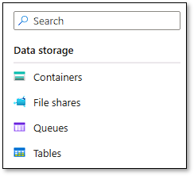
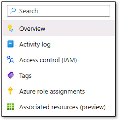
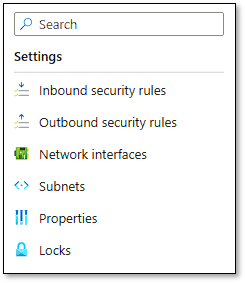

---
lab:
    title: 'Lab 04: Overview of prerequisites for deployment of SAP workloads with Azure Center for SAP solutions (ACSS)'
    learning path: 'AZ-1006 Learning Path 4: Deploy SAP on Azure'
---

# Lab 04: Overview of prerequisites for deployment of SAP workloads with Azure Center for SAP solutions (ACSS)

This lab is part of **AZ-1006: Migrate and Modernize SAP in the Microsoft Cloud**.

## Lab introduction

Azure Center for SAP Solutions (ACSS) offers a range of services and tools to help you deploy and manage your SAP environment effectively.

After completing this lab, you'll be able to:

- Implement prerequisites for deploying SAP workloads in Azure by using Azure Center for SAP solutions.

All tasks in this lab are performed from the [Azure portal](https://portal.azure.com) (including the Bash Cloud Shell session).

## Estimated time: 100 minutes

## Lab scenario

You're an SAP professional responsible for managing SAP workloads in your organization, Adatum Corporation. You're looking for ways to deploy and manage your SAP environment more efficiently on a secure, scalable, and reliable cloud platform.

## Interactive lab simulations

There are several interactive lab simulations that you might find useful for this topic. The simulation lets you click through a similar scenario at your own pace. There are differences between the interactive simulation and this lab, but many of the core concepts are the same. An Azure subscription is not required.

- [TODO](https://TODO). TODO.
  
## Architecture diagram


TODO

## Job skills

- Exercise 1: Create a Microsoft Entra user-assigned managed identity

- Exercise 2: Create the virtual network

- Exercise 3: Create an Azure Bastion resource

- Exercise 4: Create an Azure Storage General Purpose v2 account

- Exercise 5: Configure authorization of the Microsoft Entra user-assigned managed identity

- Exercise 6: Create an Azure Premium file shares account

- Exercise 7: Create and configure a network security group

- Exercise 8: Create an Azure Virtual Machine

- Exercise 9: Configure the Azure Virtual Machine

- Exercise 10: Delete the Azure resources provisioned in this lab

## Exercise 1: Create a Microsoft Entra user-assigned managed identity

In this exercise, you create a Microsoft Entra user-assigned managed identity to be used by Azure Center for SAP solutions for Azure Storage access during its deployment.

1. On the lab computer, open the [Azure portal](https://portal.azure.com) in a Microsoft Edge browser window, and authenticate by using a Microsoft Account or Microsoft Entra ID account with the Owner role in the Azure subscription you use in this lab.

1. At the top of the [Azure portal](https://portal.azure.com) page, use the **Search resources, services, and docs** text box to search for and navigate to **Managed Identities**.

1. On the **Managed Identities** page, select **+ Create**.

1. On the **Basics** tab of the **Create User Assigned Managed Identity** page, specify the following settings, and then select **Review + create** (leave others with their default values):

   |Setting|Value|
   |---|---|
   |Subscription|The name of the Azure subscription used in this lab|
   |Resource group|The name of a **new** resource group **acss-infra-RG**|
   |Region|the name of the Azure region that you use for the ACSS deployment|
   |Name|**acss-infra-MI**|

1. On the **Review** tab, wait for the validation process to complete, and then select **Create**.

   > **Note**:
   >- Do not wait for the provisioning process to complete but instead proceed to the next task. The provisioning should take just a few seconds.
   >- In one of the upcoming tasks, you will authorize access of the managed identity to the storage account hosting the SAP installation media to accommodate installing SAP software through the Azure Center for SAP solutions.

### Exercise 1 result

After you complete this exercise, you have created a Microsoft Entra user-assigned managed identity to be used by Azure Center for SAP solutions for Azure Storage access during its deployment.

## Exercise 2: Create the virtual network

In this exercise, you create the Azure virtual network that hosts all of the Azure Virtual Machines included in the deployment. In addition, within the virtual network, you create the following subnets:

- **AzureFirewallSubnet**: intended for deployment of Azure Firewall

- **AzureBastionSubnet**: intended for deployment of Azure Bastion

- **dmz**: intended for deployment of the Azure Virtual Machine used to deploy SAP software

- **app**: intended for hosting the SAP application and SAP Central Services instance servers

- **db**: intended for hosting the SAP database tier

1. At the top of the [Azure portal](https://portal.azure.com) page, use the **Search resources, services, and docs** text box to search for and navigate to **Virtual networks**.

1. On the **Virtual networks** page, select **+ Create**.

1. On the **Basics** tab of the **Create virtual network** page, specify the following settings, and then select **Next** (leave others with their default values):

   |Setting|Value|
   |---|---|
   |Subscription|The name of the Azure subscription used in this lab|
   |Resource group|**acss-infra-RG**|
   |Virtual network name|**acss-infra-VNET**|
   |Region|the name of the same Azure region you used in the previous task of this exercise|

1. On the **Security** tab, accept the default settings, and then select **Next**.

   > **Note**: At this point you could provision both Azure Bastion and Azure Firewall. Instead, you will provision them separately after the virtual network is created.

1. On the **IP addresses** tab, specify the following subnet settings and then select **Review + create** (leave others with their default values):

   |Setting|Value|
   |---|---|
   |IP address space|**10.0.0.0/16 (65,536 addresses)**|

1. In the list of subnets, select the trash bin icon to delete the **default** subnet.

1. Select **+ Add a subnet**.

1. In the **Add a subnet** pane, specify the following settings, and then select **Add** (leave others with their default values):

   |Setting|Value|
   |---|---|
   |Subnet purpose|**Azure Firewall**|
   |Starting address|**10.0.0.0**|

   > **Note**: This will automatically assign to the subnet the name **AzureFirewallSubnet** and set its size to **/26 (64 addresses)**.

1. Select **+ Add a subnet**.

1. In the **Add a subnet** pane, specify the following settings, and then select **Add** (leave others with their default values):

   |Setting|Value|
   |---|---|
   |Name|**dmz**|
   |Starting address|**10.0.0.128**|
   |Size|**/26 (64 addresses)**|

   > **Note**: This subnet will be used to host the Azure Virtual Machine you will use to install the SAP software through the Azure Center for SAP solutions.

1. Select **+ Add a subnet**.

1. In the **Add a subnet** pane, specify the following settings, and then select **Add** (leave others with their default values):

   |Setting|Value|
   |---|---|
   |Subnet purpose|**Azure Bastion**|
   |Starting address|**10.0.1.0**|
   |Size|**/24 (256 addresses)**|

   > **Note**: This will automatically assign to the subnet the name **AzureBastionSubnet**.

1. Select **+ Add a subnet**.

1. In the **Add a subnet** pane, specify the following settings, and then select **Add** (leave others with their default values):

   |Setting|Value|
   |---|---|
   |Name|**app**|
   |Starting address|**10.0.2.0**|
   |Size|**/24 (256 addresses)**|

1. Select **+ Add a subnet**.

1. In the **Add a subnet** pane, specify the following settings, and then select **Add** (leave others with their default values):

   |Setting|Value|
   |---|---|
   |Name|**db**|
   |Starting address|**10.0.3.0**|
   |Size|**/24 (256 addresses)**|

1. On the **IP addresses** tab, select **Review + create**:

1. On the **Review + create** tab, wait for the validation process to complete, and then select **Create**.

   > **Note**: Do not wait for the provisioning process to complete but instead proceed to the next task. The provisioning should take just a few seconds.

### Exercise 2 result

After you complete this exercise, you have create the Azure virtual network that hosts all of the Azure Virtual Machines included in the deployment, and subnets included in the virtual network.

## Exercise 3: Create an Azure Bastion resource

In this exercise, you create an Azure Bastion resource to secure connectivity to Azure Virtual Machines from the internet.

1. At the top of the [Azure portal](https://portal.azure.com) page, use the **Search resources, services, and docs** text box to search for and navigate to **Bastions**.

1. On the **Bastions** page, select **+ Create**.

1. On the **Basics** tab of the **Bastions** page, specify the following settings, and then select **Next : Advanced >** (leave others with their default values):

   |Setting|Value|
   |---|---|
   |Subscription|The name of the Azure subscription you use in this lab|
   |Resource group|**acss-infra-RG**|
   |Name|**acss-infra-BASTION**|
   |Region|the name of the same Azure region you used earlier in this exercise|
   |Tier|**Basic**|
   |Instance count|**2**|
   |Virtual network|**acss-infra-VNET**|
   |Subnet|**AzureBastionSubnet (10.0.1.0/24)**|
   |Public IP address|**Create new**|
   |Public IP address name|**acss-bastion-PIP**|

1. On the **Advanced** tab, review the available options without making any changes, and then select **Review + create**.

1. On the **Review + create** tab, wait for the validation process to complete, and then select **Create**.

   > **Note**: Do not wait for the provisioning to complete, but instead proceed to the next task. The provisioning might take about 5 minutes.

### Exercise 3 result

After you complete this exercise, you have created an Azure Bastion resource to secure connectivity to Azure Virtual Machines from the internet.

## Exercise 4: Create an Azure Storage General Purpose v2 account

In this exercise, you create an Azure Storage General Purpose v2 account that is associated with the Azure Center for SAP solutions used for the deployment. This storage account is used to host the SAP installation media to accommodate installing SAP software through the Azure Center for SAP solutions.

1. At the top of the [Azure portal](https://portal.azure.com) page, use the **Search resources, services, and docs** text box to search for and navigate to **Storage accounts**.

1. On the **Storage accounts** page, select **+ Create**.

1. On the **Basics** tab of the **Create a storage account** page, specify the following settings, and then select **Next: Advanced >** (leave others with their default values):

   |Setting|Value|
   |---|---|
   |Subscription|The name of the Azure subscription you use in this lab|
   |Resource group|**acss-infra-RG**|
   |Storage account name|any globally unique name between 3 and 24 in length consisting of letters and digits|
   |Region|the name of the same Azure region you used earlier in this exercise|
   |Performance|**Standard**|
   |Redundancy|**Geo-redundant storage (GRS)**|
   |Make read access to data available in the event of regional availability|Disabled|

1. On the **Advanced** tab, review the available options, accept the defaults, and then select **Next: Networking >**.

1. On the **Networking** tab, perform the following actions, and then select **Review**:

   1. Select **Enable public access from selected virtual networks and IP addresses**.

   1. In the **Virtual networks** section, ensure that the **Virtual network subscription** drop-down list displays the name of the Azure subscription you use in this lab.

   1. In the **Virtual networks** section, in the **Virtual network** drop-down list, select **acss-infra-VNET**.

   1. In the **Subnets** drop-down list, select the **app**, **db**, and **dmz** subnets.

1. On the **Review** tab, wait for the validation process to complete, and then select **Create**.

   > **Note**: Wait for the provisioning process to complete. The provisioning should take less than 1 minute.

1. On the **Your deployment is complete** page, select **Go to resource**.

1. In the left pane, select **Containers**.

   

1. Select **+ Container**.

1. In the **Name** text box, enter **sapbits**, and then select **Create**.

   > **Note**: The **sapbits** container will host the SAP installation media.

### Exercise 4 result

After you complete this exercise, you have created an Azure Storage General Purpose v2 account that is associated with the Azure Center for SAP solutions used for the deployment.

## Exercise 5: Configure authorization of the Microsoft Entra user-assigned managed identity

In this exercise, you use an Azure role-based access control (RBAC) role assignment to grant the Microsoft Entra user-assigned managed identity. The managed identity is used to perform the deployment access to the Azure subscription and the Azure Storage General Purpose v2 account created in the previous task.

1. At the top of the [Azure portal](https://portal.azure.com) page, use the **Search resources, services, and docs** text box to search for and navigate to **Managed Identities**.

1. On the Managed Identities page and, select the **acss-infra-MI** entry.

1. In the left pane, select **Azure role assignments**.

   

1. On the **Azure role assignments** page, select **+ Add role assignment (Preview)**.

1. On the **+ Add role assignment (Preview)** pane, specify the following settings, and then select **Save** (leave others with their default values):

   |Setting|Value|
   |---|---|
   |Scope|**Subscription**|
   |Subscription|The name of the Azure subscription you use in this lab|
   |Role|**Azure Center for SAP solutions service role**|

1. On the **Azure role assignments** page, select **+ Add role assignment (Preview)**.

1. On the **+ Add role assignment (Preview)** pane, specify the following settings, and then select **Save** (leave others with their default values):

   |Setting|Value|
   |---|---|
   |Scope|**Storage**|
   |Subscription|The name of the Azure subscription you use in this lab|
   |Resource|The name of the Azure Storage account you created in the previous task|
   |Role|**Reader and Data Access**|

### Exercise 5 result

After you complete this exercise, you have used an Azure role-based access control (RBAC) role assignment to grant the Microsoft Entra user-assigned managed identity.

## Exercise 6: Create an Azure Premium file shares account

In this exercise, you create an Azure Premium file shares account used to implement SAP Transport Directory.

1. At the top of the [Azure portal](https://portal.azure.com) page, use the **Search resources, services, and docs** text box to search for and navigate to **Storage accounts**.

1. On the **Storage accounts** page, select **+ Create**.

1. On the **Basics** tab of the **Create a storage account** page, specify the following settings, and then select **Next: Advanced >** (leave others with their default values):

   |Setting|Value|
   |---|---|
   |Subscription|The name of the Azure subscription used in this lab|
   |Resource group|**acss-infra-RG**|
   |Storage account name|any globally unique name between 3 and 24 in length consisting of letters and digits|
   |Region|the name of the same Azure region you used earlier in this exercise|
   |Performance|**Premium**|
   |Premium account type|**File shares**|
   |Redundancy|**Zone-redundant storage (ZRS)**|

1. On the **Advanced** tab, disable the **Require secure transfer for REST API operations** setting, and then select **Next: Networking >**.

   > **Note**: The NFS protocol does not support encryption and relies on network-level security instead. This setting must be disabled for NFS to work.

1. On the **Networking** tab, perform the following actions, and then select **Review**:

   1. Select **Enable public access from selected virtual networks and IP addresses**.

   1. In the **Virtual networks** section, ensure that the **Virtual network subscription** drop-down list displays the name of the Azure subscription used in this lab.

   1. In the **Virtual networks** section, in the **Virtual network** drop-down list, select **acss-infra-VNET**.

   1. In the **Subnets** drop-down list, select the **app**, **db**, and **dmz** subnets.

   > **Note**: In general, avoid allowing access to your internal resources from perimeter subnets. In this case, the only reason to do so is to allow for validating this access later in this lab.

1. On the **Review** tab, wait for the validation process to complete, and then select **Create**.

   > **Note**: Wait for the provisioning process to complete. The provisioning should take less than 1 minute.

1. On the **Your deployment is complete** page, select **Go to resource**.

1. In the left pane, select **File shares**, and then select **+ File share**.

   

1. On the **Basics** tab of the **New file share** page, specify the following settings, and then select **Review + create** (leave others with their default values):

   |Setting|Value|
   |---|---|
   |Name|**trans**|
   |Provisioned capacity|**128**|
   |Protocol|**NFS**|
   |Root Squash|**No Root Squash**|

1. On the **Review + create** tab, wait for the validation process to complete, and then select **Create**.

   > **Note**: Wait for the provisioning of the file share to complete. The provisioning should take just a few seconds.

1. On the **Connect to this NFS share from Linux** page, select **SUSE** in the **Select your linux distribution** drop-down list.

1. Review the sample commands to mount this NFS share.

### Exercise 6 result

After you complete this exercise, you have created an Azure Premium file shares account used to implement SAP Transport Directory.

## Exercise 7: Create and configure a network security group

In this exercise, you create and configure a network security group (NSG) used to restrict outbound access from subnets of the virtual network that hosts the deployment. You can accomplish this by blocking connectivity the internet but explicitly allowing connections to the following services:

- SUSE or Red Hat update infrastructure endpoints

- Azure Storage

- Azure Key Vault

- Microsoft Entra ID

- Azure Resource Manager

> **Note**: In general, you should consider using Azure Firewall instead of NSGs to secure network connectivity for your SAP deployment. This lab covers both options.

1. At the top of the [Azure portal](https://portal.azure.com) page, use the **Search resources, services, and docs** text box to search for and navigate to **Network security groups**.

1. On the **Network security groups** page, select **+ Create**.

1. On the **Basics** tab of the **Create network security group** page, specify the following settings, and then select **Review + create** (leave others with their default values):

   |Setting|Value|
   |---|---|
   |Subscription|The name of the Azure subscription used in this lab|
   |Resource group|**acss-infra-RG**|
   |Name|**acss-infra-NSG**|
   |Region|the name of the same Azure region you used earlier in this exercise|

1. On the **Review + create** tab, wait for the validation process to complete, and then select **Create**.

   > **Note**: Wait for the provisioning process to complete. The provisioning should take less than 1 minute.

1. On the **Your deployment is complete** page, select **Go to resource**.

   > **Note**: By default, the built-in rules of network security groups allow all outbound traffic, all traffic within the same virtual network, as well as all traffic between peered virtual networks. From the security standpoint, you should consider restricting this default behavior. The proposed configuration restricts outbound connectivity to the internet and Azure. You can also use NSG rules to restrict connectivity within a virtual network.

1. In the left pane, select **Outbound security rules**.

   

1. On the **acss-infra-NSG \| Outbound security rules** page, select **+ Add**.

1. On the **Add outbound security rule** pane, specify the following settings, and then select **Add** (leave others with their default values):

   |Setting|Value|
   |---|---|
   |Source|**Any**|
   |Source port ranges|*|
   |Destination|**IP addresses**|
   |Destination IP addresses/CIDR ranges|**13.91.47.76,40.85.190.91,52.187.75.218,52.174.163.213,52.237.203.198**|
   |Service|**Custom**|
   |Destination port ranges|*|
   |Protocol|**Any**|
   |Action|**Allow**|
   |Priority|**300**|
   |Name|**AllowAnyRHELOutbound**|
   |Description|**Allow outbound connectivity to RHEL update infrastructure endpoints**|

   > **Note**:
   >- This rule explicitly allows connectivity to Red Hat update infrastructure endpoints.
   >- To identify the IP addresses to use for RHEL, refer to [Prepare network for infrastructure deployment](https://learn.microsoft.com/en-us/azure/sap/center-sap-solutions/prepare-network#allowlist-suse-or-red-hat-endpoints)

1. On the **acss-infra-NSG \| Outbound security rules** page, select **+ Add**.

1. In the **Add outbound security rule** pane, specify the following settings, and then select **Add** (leave others with their default values):

   |Setting|Value|
   |---|---|
   |Source|**Any**|
   |Source port ranges|*|
   |Destination|**IP addresses**|
   |Destination IP addresses/CIDR ranges|**52.188.224.179,52.186.168.210,52.188.81.163,40.121.202.140**|
   |Service|**Custom**|
   |Destination port ranges|*|
   |Protocol|**Any**|
   |Action|**Allow**|
   |Priority|**305**|
   |Name|**AllowAnySUSEOutbound**|
   |Description|**Allow outbound connectivity to SUSE update infrastructure endpoints**|

   > **Note**:
   >- This rule explicitly allows connectivity to SUSE update infrastructure endpoints.
   >- To identify the IP addresses to use for SUSE, refer to [Prepare network for infrastructure deployment](https://learn.microsoft.com/en-us/azure/sap/center-sap-solutions/prepare-network#allowlist-suse-or-red-hat-endpoints).

1. On the **acss-infra-NSG \| Outbound security rules** page, select **+ Add**.

1. In the **Add outbound security rule** pane, specify the following settings, and then select **Add** (leave others with their default values):

   |Setting|Value|
   |---|---|
   |Source|**Any**|
   |Source port ranges|*|
   |Destination|**Service Tag**|
   |Destination service tag|**Storage**|
   |Service|**Custom**|
   |Destination port ranges|*|
   |Protocol|**Any**|
   |Action|**Allow**|
   |Priority|**400**|
   |Name|**AllowAnyCustomStorageOutbound**|
   |Description|**Allow outbound connectivity to Azure Storage**|

   > **Note**:
   >- This rule explicitly allows connectivity to Azure Storage.
   >- You could replace the **Storage** service tag with one which is region-specific, such as **Storage.EastUS**.

1. On the **acss-infra-NSG \| Outbound security rules** page, select **+ Add**.

1. In the **Add outbound security rule** pane, specify the following settings, and then select **Add** (leave others with their default values):

   |Setting|Value|
   |---|---|
   |Source|**Any**|
   |Source port ranges|*|
   |Destination|**Service Tag**|
   |Destination service tag|**AzureKeyVault**|
   |Service|**Custom**|
   |Destination port ranges|*|
   |Protocol|**Any**|
   |Action|**Allow**|
   |Priority|**500**|
   |Name|**AllowAnyCustomKeyVaultOutbound**|
   |Description|**Allow outbound connectivity to Azure Key Vault**|

   > **Notes**: This rule explicitly allows connectivity to Azure Key Vault.

1. On the **acss-infra-NSG \| Outbound security rules** page, select **+ Add**.

1. In the **Add outbound security rule** pane, specify the following settings, and then select **Add** (leave others with their default values):

   |Setting|Value|
   |---|---|
   |Source|**Any**|
   |Source port ranges|*|
   |Destination|**Service Tag**|
   |Destination service tag|**AzureActiveDirectory**|
   |Service|**Custom**|
   |Destination port ranges|*|
   |Protocol|**Any**|
   |Action|**Allow**|
   |Priority|**600**|
   |Name|**AllowAnyCustomEntraIDOutbound**|
   |Description|**Allow outbound connectivity to Microsoft Entra ID**|

   > **Note**: This rule explicitly allows connectivity to Microsoft Entra ID.

1. On the **acss-infra-NSG \| Outbound security rules** page, select **+ Add**.

1. In the **Add outbound security rule** pane, specify the following settings, and then select **Add** (leave others with their default values):

   |Setting|Value|
   |---|---|
   |Source|**Any**|
   |Source port ranges|*|
   |Destination|**Service Tag**|
   |Destination service tag|**AzureResourceManager**|
   |Service|**Custom**|
   |Destination port ranges|*|
   |Protocol|**Any**|
   |Action|**Allow**|
   |Priority|**700**|
   |Name|**AllowAnyCustomARMOutbound**|
   |Description|**Allow outbound connectivity to Azure Resource Manager**|

   > **Note**: This rule explicitly allows connectivity to Azure Resource Manager.

1. On the **acss-infra-NSG \| Outbound security rules** page, select **+ Add**.

1. In the **Add outbound security rule** pane, specify the following settings, and then select **Add** (leave others with their default values):

   |Setting|Value|
   |---|---|
   |Source|**Any**|
   |Source port ranges|*|
   |Destination|**Service Tag**|
   |Destination service tag|**Internet**|
   |Service|**Custom**|
   |Destination port ranges|*|
   |Protocol|**Any**|
   |Action|**Deny**|
   |Priority|**1000**|
   |Name|**DenyAnyCustomInternetOutbound**|
   |Description|**Deny outbound connectivity to Internet**|

   > **Note**: This rule explicitly blocks connectivity to the internet.

1. Finally, you need to assign the NSG to the relevant subnets of the virtual network that will host the SAP deployment. In the left pane, select **Subnets**.

   

1. On the **acss-infra-NSG \| Subnets** page, select **+ Associate**.

1. In the **Associate subnet** pane, in the **Virtual network** drop-down list, select **acss-intra-VNET (acss-infra-RG)**.

1. In the **Subnet** drop-down list, select **app**, and then select **OK**.

1. On the **acss-infra-NSG \| Subnets** page, select **+ Associate**.

1. In the **Associate subnet** pane, in the **Virtual network** drop-down list, select **acss-intra-VNET (acss-infra-RG)**

1. In the **Subnet** drop-down list, select **db**, and then select **OK**.

### Exercise 7 result

After you complete this exercise, you have created and configured a network security group (NSG) used to restrict outbound access from subnets of the virtual network that hosts the deployment.

## Exercise 8: Create an Azure Virtual Machine

In this exercise, you create an Azure Virtual Machine used for SAP software installation as part of an Azure Center for SAP solutions deployment.

1. At the top of the [Azure portal](https://portal.azure.com) page, use the **Search resources, services, and docs** text box to search for and navigate to **Virtual machines**.

1. On the **Virtual machines** page, select **+ Create** and, in the drop-down menu, select **Azure Virtual Machine**.

1. On the **Basics** tab of the **Create a virtual machine** page, specify the following settings, and then select **Next: Disks >** (leave others with their default values):

   |Setting|Value|
   |---|---|
   |Subscription|The name of the Azure subscription used in this lab|
   |Resource group|**acss-infra-RG**|
   |Virtual machine name|**acss-infra-vm0**|
   |Region|the name of the same Azure region you used earlier in this exercise|
   |Availability options|**No infrastructure redundancy required**|
   |Security type|**Trusted launch virtual machine**|
   |Image|**Ubuntu Server 20.04 LTS - x64 Gen2**|
   |VM architecture|**x64**|
   |Run with Azure Spot Discount|disabled|
   |Size|**Standard_B2ms** (see note below)|
   |Authentication type|**Password**|
   |Username|any valid user name|
   |Password|any complex password of your choice (see note below)|
   |Public inbound ports|**None**|

    > **Note**:
    >- To locate the size, select the **See all sizes** link, type **B2ms** in the search text box, and then select **B2ms**.
    >- Make sure you remember the username and password you specified. You will need it later in this lab.

1. On the **Disks** tab, accept the default values, and then select **Next: Networking >**.

1. On the **Networking** tab, specify the following settings, and then select **Next: Management >** (leave others with their default values):

   |Setting|Value |
   |---|---|
   |Virtual network|**acss-infra-VNET**|
   |Subnet|**dmz**|
   |Public IP address|**None**|
   |NIC network security group|**None**|
   |Delete NIC when VM is deleted|enabled|
   |Load balancing Options|**None**|

1. On the **Management** tab, leave all settings with their default values, and then select **Next: Monitoring >**.

1. On the **Monitoring** tab, set **Boot diagnostics** to **Disable**, and then select **Next: Advanced >** (leave all other settings with their default values).

1. On the **Advanced** tab, leave all settings with their default values, and then select **Review + create**.

1. On the **Review + create** tab, select **Create**.

   > **Note**: Wait for the provisioning to complete. The provisioning might take about 3 minutes.

### Exercise 8 result

After you complete this exercise, you have created an Azure Virtual Machine used for SAP software installation as part of an Azure Center for SAP solutions deployment.

## Exercise 9: Configure the Azure Virtual Machine

In this exercise, you connect to the Azure Virtual Machine by using Azure Bastion, and configure it for the SAP software installation.

> **Note**: Before you start this exercise, ensure that the Azure Bastion provisioning has completed. Also, disable your web browser's pop-up blocker functionality, if it has it.

1. At the top of the [Azure portal](https://portal.azure.com) page, use the **Search resources, services, and docs** text box to search for and navigate to **Virtual machines**.

1. On the **Virtual machines** page, select the **acss-infra-vm0** entry.

1. On the **acss-infra-vm0** page, select **Connect** and, in the drop-down menu, select **Connect via Bastion**.

1. On the **acss-infra-vm0 \| Bastion** page, ensure that the **Authentication Type** is set to **VM Password**.

1. In the **Username** and **Password** text boxes, enter the username and password you set when provisioning the Azure Virtual Machine.

1. Ensure that the **Open in new browser tab** checkbox is enabled, and then select **Connect**.

   > **Note**: This should open another web browser window tab displaying the shell session running in the Azure Virtual Machine.

1. To prepare the Ubuntu server for the upload of SAP installation media, you will install Azure CLI. In the newly opened browser tab, within the shell session, run the following command to install Azure CLI:

   ```bash
   curl -sL https://aka.ms/InstallAzureCLIDeb | sudo bash
   ```

1. Within the shell session, run the following command to install PIP3:

   ```bash
   sudo apt install python3-pip
   ```

   > **Note**: If you are prompted, press **y** and then press **Enter** to confirm.

1. Within the shell session, run the following command to install Ansible 2.13.19:

   ```bash
   sudo pip3 install ansible-core==2.13.9
   ```

1. Within the shell session, run the following command to install Ansible galaxy collection modules:

   ```bash
   sudo ansible-galaxy collection install ansible.netcommon:==5.0.0 -p /opt/ansible/collections
   sudo ansible-galaxy collection install ansible.posix:==1.5.1 -p /opt/ansible/collections
   sudo ansible-galaxy collection install ansible.utils:==2.9.0 -p /opt/ansible/collections
   sudo ansible-galaxy collection install ansible.windows:==1.13.0 -p /opt/ansible/collections
   sudo ansible-galaxy collection install community.general:==6.4.0 -p /opt/ansible/collections
   ```

1. Within the shell session, run the following command to clone the SAP automation samples repository from GitHub:

   ```bash
   git clone https://github.com/Azure/SAP-automation-samples.git
   ```

1. Within the shell session, run the following command to clone the SAP automation repository from GitHub:

   ```bash
   git clone https://github.com/Azure/sap-automation.git
   ```

1. Within the shell session, run the following command to terminate the session:

   ```bash
   logout
   ```

1. When prompted, select **Close**.

### Exercise 9 result

After you complete this exercise, you have connected to the Azure Virtual Machine by using Azure Bastion, and configured it for the SAP software installation.

## Exercise 10: Delete the Azure resources provisioned in this lab

In this exercise, you remove all Azure resources provisioned in this lab.

1. At the top of the [Azure portal](https://portal.azure.com) page, click the Cloud Shell icon to start a Bash session in Cloud Shell.

   

   > **Note**: If this is the first time you are launching Cloud Shell in the current Azure subscription, you will be asked to create an Azure file share to persist Cloud Shell files. If so, accept the defaults, which will result in creation of a storage account in an automatically generated resource group.

1. In the Cloud Shell pane, run the following command to delete the resource group **acss-infra-RG** and all of its resources.

   ```cli
   az group delete --name 'acss-infra-RG' --no-wait --yes
   ```

   > **Note**: The command executes asynchronously (as determined by the `--nowait` parameter), so while the shell prompt will appear immediately after invoking it, a few minutes will pass before the resource group and its resources are actually removed.

1. Close the Cloud Shell pane.

### Exercise 10 result

After you complete this exercise, you have removed all Azure resources provisioned in this lab.

## Key takeaways

Congratulations! Now that you have completed this lab, you know how to:

- Create a Microsoft Entra user-assigned managed identity

- Create the virtual network

- Create an Azure Bastion resource

- Create an Azure Storage General Purpose v2 account

- Configure authorization of the Microsoft Entra user-assigned managed identity

- Create an Azure Premium file shares account

- Create and configure a network security group

- Create an Azure Virtual Machine

- Configure the Azure Virtual Machine

- Delete the Azure resources provisioned in this lab

## Learn more with self-paced training

- [TODO](https://TODO). TODO.
